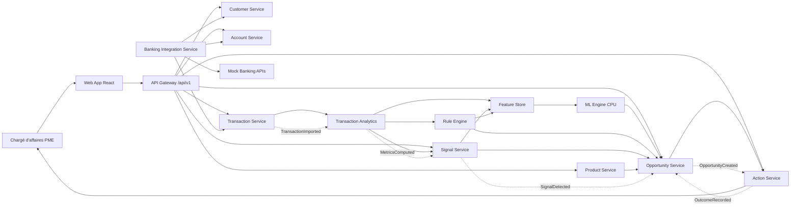
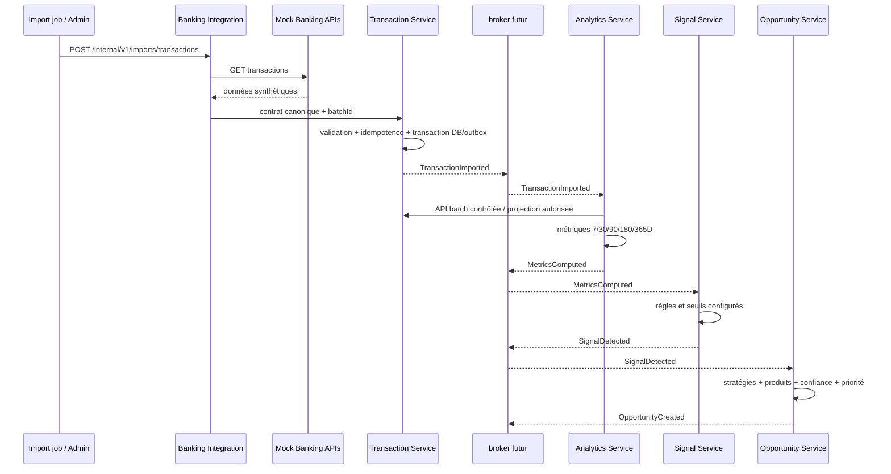

# Architecture exécutable — BOA SME Opportunity Intelligence

**Version :** 1.1 — architecture MVP avec propension commerciale CPU

**Statut :** décision d’architecture pour implémentation

**Périmètre :** démonstrateur exécutable avec données synthétiques, destiné aux chargés d’affaires PME de BANK OF AFRICA Maroc

---

## 1. Décision d’architecture en une page

Le MVP est construit comme un **système de microservices orientés domaine**, exposé par une API REST versionnée et protégé par OpenID Connect. Le frontend React/TypeScript ne connaît ni la base de données ni les règles de détection. Il appelle exclusivement l’API Gateway. Chaque service possède son contrat, son modèle de données et la responsabilité d’un seul bounded context.

Le parcours métier est le suivant :



### 1.1 Choix structurants

| Décision | Choix retenu | Raisonnement |
|---|---|---|
| Style d’architecture | Microservices pragmatiques, API-first, domain-driven | Les flux transactionnels, l’intelligence commerciale et les actions ont des cycles de vie distincts. Les frontières doivent rester remplaçables par les systèmes BOA réels. |
| Bounded contexts | Référentiel client, comptes, transactions, analyse, signaux, opportunités, catalogue produits, actions, intégration bancaire, identité/audit | Chaque contexte possède un langage métier et une source de vérité distincts. |
| Runtime backend | Python 3.12, FastAPI, Python | Stack recommandée dans les exigences, adaptée aux APIs sécurisées, à l’injection de dépendances, aux tests xUnit et à l’écosystème bancaire Microsoft. |
| Frontend | React + TypeScript + Vite | Type safety, routing, client API explicite, états de chargement/erreur et évolution vers une application métier complète. |
| API | REST JSON, OpenAPI 3.0, `/api/v1` | Contrats faciles à tester, intégrer et remplacer côté consommateurs internes ou futurs systèmes BOA. |
| Données | PostgreSQL, une instance Docker avec une base logique par service au MVP | Une seule instance simplifie le démarrage local, tandis que les bases/logical schemas séparés évitent la base partagée de fait. Une séparation physique est possible en production. |
| Événements | Contrats CloudEvents-like, publication via broker futur au MVP et outbox PostgreSQL | Le moteur reste découplé du transport. broker futur fournit une exécution locale réellement event-driven sans imposer Kafka dès le POC. |
| Identité | Keycloak local, OIDC/OAuth2, JWT et RBAC | IdP remplaçable par celui de BOA sans réécrire les services. |
| Calcul de priorité commerciale | Règles versionnées en `RULES_ONLY` + propension logistique CPU observée en `POC_SHADOW` | Le score reste traçable mais ne réordonne aucune opportunité et n’influence ni éligibilité ni recommandation. Il ne constitue ni une performance de production ni une décision de crédit. |
| Observabilité | Logs structurés, correlation ID, OpenTelemetry, métriques Prometheus, traces et health checks | Les chaînes d’analyse sont asynchrones et nécessitent une traçabilité de bout en bout. |
| Déploiement | Docker Compose pour le MVP, images immuables et variables d’environnement | Une commande `docker compose up` démarre l’environnement complet tout en gardant une trajectoire vers Kubernetes ou une plateforme privée BOA. |

### 1.2 Ce que cette architecture ne prétend pas être

Cette architecture est **BIAN-inspired**. Elle reprend les idées de Service Domains, de capacités métier, d’APIs orientées domaine et d’orchestration. Elle ne constitue ni une implémentation complète de BIAN ni une certification de conformité. Le mapping détaillé doit être conservé dans `architecture/bian-mapping.md` lors de l’implémentation.

Le signal `FINANCIAL_STRESS_SIGNAL` n’est jamais un score de crédit, une probabilité de défaut, une décision de crédit ou une notation de risque. Il s’agit d’un signal relationnel destiné au chargé d’affaires, avec une explication et des données justificatives.

---

## 2. Bounded contexts et langage métier

Un bounded context est une zone dans laquelle un terme, une règle et un modèle ont une signification cohérente. Les identifiants et les DTO sont partagés au travers de contrats minimaux, mais les entités et les règles internes ne sont pas partagées entre services.

### 2.1 Référentiel client — Customer Management

Ce contexte représente la PME comme partie commerciale de la banque. Il possède le profil légal ou synthétique de l’entreprise, son secteur, son segment, son chargé d’affaires, son portefeuille et son statut. Il ne possède ni le solde courant ni les transactions.

**Termes principaux :** `Customer`, `SME`, `Sector`, `Segment`, `RelationshipManager`, `PortfolioAssignment`.

**Propriétaire des données :** Customer Service.

**Exclusions :** les comptes sont référencés par identifiant ; les produits détenus sont consultés auprès de Product Service ou d’un read model d’agrégation, sans copie maîtresse dans Customer Service.

### 2.2 Comptes — Current Account Management

Ce contexte représente les comptes associés à une PME, leur devise, leur type, leur statut, leurs limites et leurs soldes observés. Il conserve les snapshots de balance nécessaires à la lecture et aux calculs d’utilisation des lignes.

**Termes principaux :** `Account`, `BalanceSnapshot`, `Currency`, `AccountType`, `CreditLine`, `AccountStatus`.

**Propriétaire des données :** Account Service.

**Exclusions :** une transaction est possédée par Transaction Service ; Account Service ne recalcule pas les métriques commerciales.

### 2.3 Transactions et paiements — Payment / Transaction Management

Ce contexte normalise les mouvements crédit et débit, les virements, les paiements fournisseurs, les opérations internationales, la contrepartie, la catégorie et le lien vers le compte. Il accepte des données provenant de plusieurs adapters via un modèle canonique.

**Termes principaux :** `Transaction`, `Direction`, `TransactionType`, `Counterparty`, `Category`, `InternationalFlag`, `ImportBatch`.

**Propriétaire des données :** Transaction Service.

**Exclusions :** ce contexte ne déduit pas l’existence d’une opportunité et ne prend aucune décision commerciale.

### 2.4 Analyse financière — Financial Analysis

Ce contexte transforme les transactions et les soldes en indicateurs temporels. Il calcule, pour 7, 30, 90, 180 et 365 jours, les valeurs courantes, la période précédente et la baseline historique comparable. Il intègre une première protection contre les faux positifs et la saisonnalité.

**Termes principaux :** `Metric`, `Period`, `Baseline`, `GrowthRate`, `AverageBalance`, `CreditUtilization`, `SeasonalityAdjustment`.

**Propriétaire des données :** Transaction Analytics Service.

**Exclusions :** il ne choisit pas un produit et ne classe pas une opportunité.

### 2.5 Détection de signaux — Signal Detection

Ce contexte évalue les métriques contre des règles de signal configurables. Il produit des signaux versionnés, avec seuil, valeur, sévérité, période, preuves textuelles et références de métriques.

**Termes principaux :** `Signal`, `SignalType`, `Severity`, `Threshold`, `Evidence`, `RuleVersion`.

**Propriétaire des données :** Signal Service.

**Exclusions :** un signal n’est pas encore une opportunité. Il peut être consommé par plusieurs stratégies.

### 2.6 Opportunités commerciales — Sales Opportunity Management

Ce contexte combine des signaux, le profil client, les produits détenus, les écarts de produits et l’historique pour produire une opportunité. Il calcule la confiance explicable, le niveau de priorité, l’horizon, les raisons et les produits recommandés. Il conserve la décision et sa traçabilité.

**Termes principaux :** `Opportunity`, `OpportunityType`, `Confidence`, `Priority`, `Horizon`, `Evidence`, `Recommendation`, `EngineVersion`.

**Propriétaire des données :** Opportunity Service.

**Règle de vocabulaire :** `FINANCIAL_STRESS_SIGNAL` doit être affiché comme « signal de tension financière » et non comme « risque ».

### 2.7 Produits — Product Management / Product Directory

Ce contexte possède le référentiel de produits utilisable par le moteur : financement d’investissement, financement du cycle d’exploitation, avances et découverts, opérations à l’international, gestion des flux, dépôts à terme et placements en OPCVM. Les lacunes sont agrégées par famille ; les recommandations référencent un produit précis. Les descriptions et URL proviennent de pages publiques, tandis que le ciblage, les critères et toute règle d’éligibilité restent des données gouvernées à valider avec BOA, jamais des constantes du moteur.

**Termes principaux :** `Product`, `ProductFamily`, `ProductCategory`, `EligibilityRule`, `TargetSegment`, `CustomerProduct`, `ProductGap`.

**Propriétaire des données :** Product Service.

### 2.8 Actions et résultats — Customer Relationship / Sales Action

Ce contexte gère l’acceptation ou le rejet d’une opportunité, le contact, le rendez-vous, l’offre et la conversion. Il enregistre l’outcome sans l’écraser par l’état courant de l’opportunité. Cette chaîne permet de mesurer le taux de contact, de réunion, d’offre, de conversion et les faux positifs.

**Termes principaux :** `OpportunityAction`, `ActionType`, `Outcome`, `FollowUp`, `Conversion`.

**Propriétaire des données :** Action Service.

### 2.9 Intégration bancaire — Banking Integration / Anti-Corruption Layer

Ce contexte isole les systèmes sources. Il expose des ports internes stables et implémente, pour le MVP, des adapters HTTP vers les Mock Banking APIs. Le cœur métier ne contient jamais `if mock then`.

**Ports :** `CoreBankingPort`, `PaymentPort`, `TradeFinancePort`, `CRMPort`, `ProductPort`.

**Adapters MVP :** `MockCoreBankingAdapter`, `MockPaymentAdapter`, `MockTradeFinanceAdapter`, `MockCRMAdapter`, `MockProductAdapter`.

### 2.10 Identité, audit et gouvernance transverse

L’identité est externalisée à Keycloak. Les services valident le token et appliquent leur autorisation. L’audit métier est possédé par le service qui prend la décision ou reçoit l’action ; un audit collector pourra centraliser les événements en phase ultérieure. Les préoccupations transverses sont implémentées par librairie technique commune minimale, sans introduire un modèle métier partagé.

---

## 3. Découpage des microservices

Chaque service est une application FastAPI indépendante, versionnée et conteneurisée. Chaque service expose au minimum `/health`, `/ready` et `/metrics`, ainsi qu’un endpoint OpenAPI adapté à son contrat. Le Gateway agrège les contrats publiés, mais ne déplace pas les règles métier dans sa propre application.

### 3.1 Frontend Web App

Le frontend React/TypeScript est une application de présentation pour le RM. Il contient le routing, la gestion de session OIDC, un client HTTP typé, les états de chargement et d’erreur, la pagination, la recherche, les filtres et les graphiques. Il ne contient aucune opportunité, aucun score, aucune règle et aucune réponse API simulée.

Écrans MVP : dashboard, liste des opportunités, détail et explication, fiche Customer 360, signaux, actions, catalogue produits et administration en lecture contrôlée.

### 3.2 API Gateway

**Responsabilités :** point d’entrée public, validation OIDC/JWT, contrôle RBAC de premier niveau, routage, API versioning, correlation ID, rate limiting, normalisation des erreurs et agrégation limitée des réponses de présentation lorsque cela évite un aller-retour inutile.

**Technologie :** FastAPI derrière un proxy léger compatible avec le déploiement. Le Gateway ne lit jamais PostgreSQL et ne contient pas la logique `INVESTMENT_FINANCING`, `TRADE_FINANCE`, `CASH_INVESTMENT` ou `FINANCIAL_STRESS_SIGNAL`.

**Routes principales :**

```text
GET  /api/v1/opportunities
GET  /api/v1/opportunities/{opportunityId}
GET  /api/v1/opportunities/{opportunityId}/explanation
GET  /api/v1/customers
GET  /api/v1/customers/{customerId}
GET  /api/v1/customers/{customerId}/accounts
GET  /api/v1/customers/{customerId}/transactions
GET  /api/v1/signals
GET  /api/v1/products
POST /api/v1/opportunities/{opportunityId}/actions
GET  /api/v1/actions
GET  /api/v1/metrics/dashboard
```

**Dépendances :** Keycloak pour les métadonnées OIDC ; services métier pour les routes. Aucune dépendance à un schéma de base partagé.

### 3.3 Customer Service

**Responsabilités :** CRUD contrôlé et recherche paginée des PME, profil, secteur, segment, RM assigné, comptes référencés et relation produit. Il fournit les données de Customer 360 qui lui appartiennent.

**API interne/externe :**

```text
GET /api/v1/customers?search=&sector=&segment=&relationshipManagerId=&page=&pageSize=
GET /api/v1/customers/{customerId}
GET /api/v1/customers/{customerId}/accounts
GET /api/v1/customers/{customerId}/products
```

**Données :** `customers`, `relationship_managers`, `customer_assignments` et les projections nécessaires à la recherche. Le service publie `CustomerImported` et `CustomerAssignmentChanged`.

### 3.4 Account Service

**Responsabilités :** comptes, devises, statuts, types, soldes, limites et snapshots de solde. Il expose les balances pour le Customer 360 et les indicateurs de trésorerie.

```text
GET /api/v1/accounts?page=&pageSize=&customerId=
GET /api/v1/accounts/{accountId}
GET /api/v1/customers/{customerId}/accounts
GET /api/v1/accounts/{accountId}/balances?fromDate=&toDate=
```

**Données :** `accounts`, `balances`, `credit_lines`. Il publie `BalanceImported` et `AccountImported`.

### 3.5 Transaction Service

**Responsabilités :** ingestion normalisée, dédoublonnage, recherche et pagination des crédits, débits, paiements, virements internationaux et contreparties. Les filtres obligatoires sont `fromDate`, `toDate`, `type`, `direction`, `currency`, `category`, `international`, `minAmount` et `maxAmount`.

```text
GET /api/v1/transactions?fromDate=&toDate=&type=&direction=&currency=&category=&international=&minAmount=&maxAmount=&page=&pageSize=
GET /api/v1/customers/{customerId}/transactions?...&page=&pageSize=
GET /api/v1/accounts/{accountId}/transactions?...&page=&pageSize=
```

**Données :** `transactions`, `counterparties`, `import_batches`. Les index portent au minimum sur `(customer_id, booking_date)`, `(account_id, booking_date)`, `(customer_id, international, booking_date)`, `(customer_id, category, booking_date)` et l’identifiant externe unique.

**Événement :** `TransactionImported` contient l’identifiant de lot et un périmètre, pas nécessairement chaque transaction dans le message. Les consommateurs relisent les données par API ou par projection autorisée.

### 3.6 Banking Integration Service

**Responsabilités :** synchronisation ou import batch depuis les APIs bancaires, mapping vers les contrats canoniques, retry, timeout, circuit breaker, idempotence et journal du lot. Il propose une commande d’import et des endpoints de diagnostic réservés à l’administration.

```text
POST /internal/v1/imports/customers
POST /internal/v1/imports/accounts
POST /internal/v1/imports/transactions
GET  /internal/v1/imports/{batchId}
```

Le service appelle uniquement des interfaces :

```text
CoreBankingPort    -> MockCoreBankingAdapter ou futur CoreBankingAdapter
PaymentPort        -> MockPaymentAdapter ou futur PaymentAdapter
TradeFinancePort   -> MockTradeFinanceAdapter ou futur TradeFinanceAdapter
CRMPort            -> MockCRMAdapter ou futur CRMAdapter
ProductPort        -> MockProductAdapter ou futur ProductAdapter
```

Les Mock Banking APIs sont des endpoints HTTP réellement appelés, par exemple `/mock/core/customers`, `/mock/core/accounts`, `/mock/core/balances`, `/mock/core/transactions`, `/mock/payments/international` et `/mock/trade-finance/products`. Les données mockées ne sont jamais injectées directement dans le moteur.

### 3.7 Transaction Analytics Service

**Responsabilités :** calculer les métriques de 7, 30, 90, 180 et 365 jours, les comparer à la période précédente et à une baseline historique comparable. Il calcule notamment : `MONTHLY_INFLOW`, `MONTHLY_OUTFLOW`, `AVERAGE_BALANCE`, `MINIMUM_BALANCE`, `MAXIMUM_BALANCE`, `TRANSACTION_COUNT`, `SUPPLIER_PAYMENT_GROWTH`, `INTERNATIONAL_FLOW_GROWTH`, `CASH_BALANCE_GROWTH` et `CREDIT_LINE_UTILIZATION`.

**API :**

```text
GET /api/v1/analytics/customers/{customerId}/metrics?period=90D
GET /api/v1/analytics/customers/{customerId}/trends?metric=monthly_inflow
POST /internal/v1/analytics/recompute
```

**Données :** `financial_metrics`, `metric_periods`, `calculation_runs`, `seasonality_baselines`. Les calculs sont séparés de la charge transactionnelle. Pour le MVP, le service peut lire une réplique logique ou un accès API batch contrôlé ; il ne doit pas faire de requête SQL dans la base d’un autre service.

**Protection contre les faux positifs :** une opération isolée ne constitue pas une tendance. Le calcul fournit le nombre d’observations, la variance ou une mesure de stabilité simple, la comparaison historique et un indicateur de saisonnalité.

### 3.8 Signal Service

**Responsabilités :** appliquer les règles de signaux activées, produire les signaux et conserver leurs preuves. Les règles sont stockées dans `signal_rules` et versionnées. Le code fournit les types d’évaluateurs ; les seuils et l’activation sont configurables par l’ADMIN.

**Types MVP :** `INFLOW_GROWTH`, `OUTFLOW_GROWTH`, `SUPPLIER_PAYMENT_GROWTH`, `INTERNATIONAL_FLOW_GROWTH`, `BALANCE_SURPLUS`, `BALANCE_DECLINE`, `CREDIT_UTILIZATION_INCREASE`, `TRANSACTION_VOLUME_GROWTH`.

```text
GET /api/v1/signals?customerId=&type=&severity=&fromDate=&toDate=&page=&pageSize=
GET /api/v1/signals/{signalId}
POST /internal/v1/signals/evaluate
```

Un signal comprend au minimum `signalId`, `customerId`, `type`, `severity`, `value`, `threshold`, `detectedAt`, `period`, `metricReferences`, `evidence`, `ruleVersion` et `correlationId`.

### 3.9 Opportunity Service

**Responsabilités :** orchestrer les stratégies de détection d’opportunités, consulter le catalogue et le gap produit, calculer la confiance, sélectionner l’horizon, calculer la priorité et exposer l’explication complète.

**Interfaces de stratégie :**

```text
IOpportunityStrategy
  RuleBasedOpportunityStrategy
  StatisticalOpportunityStrategy
  ML reranking adapter (propension POC CPU, après éligibilité déterministe)
```

Le MVP active `RuleBasedOpportunityStrategy`, les règles publiées de Rule Studio et une propension logistique POC. Feature Store matérialise le Feature Set `sales-features-v2` via les contrats HTTP Customer, Analytics, Signal et Rule Engine. ML Engine consomme ce snapshot par HTTP et persiste `modelVersion`, `featureVersion`, `trainingDatasetVersion`, `deploymentMode` et `traceId`. Opportunity Service applique ensuite un reranking pondéré règles 65 % / ML 35 % aux candidates déjà éligibles. Le moteur ne reçoit pas de texte libre, ne dépend d’aucun LLM ou GPU et ne prend aucune décision de crédit.

```text
GET  /api/v1/opportunities?type=&confidenceMin=&priority=&sector=&segment=&relationshipManagerId=&horizon=&date=&page=&pageSize=
GET  /api/v1/opportunities/{opportunityId}
GET  /api/v1/opportunities/{opportunityId}/explanation
POST /internal/v1/opportunities/generate
```

**Données :** `opportunities`, `opportunity_evidence`, `opportunity_decision_audits`, `engine_versions`, `opportunity_product_recommendations`.

### 3.10 Product Service

**Responsabilités :** catalogue, activation, règles d’éligibilité, segment, devise et relation entre une PME et ses produits détenus. Le service rend les produits disponibles au moteur par contrat stable.

```text
GET  /api/v1/products?category=&targetSegment=&active=&page=&pageSize=
GET  /api/v1/products/{productId}
GET  /api/v1/customers/{customerId}/products
POST /api/v1/admin/products
PATCH /api/v1/admin/products/{productId}
```

Le moteur ne contient jamais les chaînes `Investment Financing` ou `Trade Finance` comme règles d’éligibilité. Il utilise `productId`, catégorie et attributs renvoyés par Product Service.

### 3.11 Action Service

**Responsabilités :** enregistrer les actions du RM et leurs outcomes. Une action est append-only sur les événements métier importants ; son statut de suivi peut être projeté pour l’interface.

```text
POST /api/v1/opportunities/{opportunityId}/actions
GET  /api/v1/opportunities/{opportunityId}/actions
PATCH /api/v1/actions/{actionId}
```

Types d’actions : `ACCEPT_OPPORTUNITY`, `DISMISS_OPPORTUNITY`, `CONTACT_CUSTOMER`, `CREATE_FOLLOW_UP`, `SCHEDULE_MEETING`, `MARK_CONVERTED`.

Outcomes : `CONTACTED`, `MEETING_SCHEDULED`, `OFFER_CREATED`, `CONVERTED`, `REJECTED`, `NOT_RELEVANT`.

Le service publie `OpportunityAccepted`, `OpportunityDismissed`, `CustomerContacted`, `MeetingScheduled`, `OpportunityConverted` et `OpportunityOutcomeRecorded`. Le service de notification, s’il est activé, consomme ces événements ; il ne décide jamais de l’opportunité.

### 3.12 Demo Data Generator

Ce n’est pas un microservice métier. C’est un job CLI ou un conteneur one-shot versionné, lancé par `make seed` ou `docker compose run --rm demo-data-generator`. Il appelle les APIs Mock Banking ou les ports d’import, génère 500 PME, douze mois d’historique, plusieurs centaines de milliers de transactions cohérentes et des scénarios connus. Il ne crée jamais directement des opportunités.

---

## 4. Modèle de données et propriété des bases

### 4.1 Règle de propriété

Le MVP utilise une instance PostgreSQL pour réduire le coût de démarrage local, mais chaque service dispose d’une **base logique dédiée** ou, au minimum, d’un schema dédié avec un compte SQL dédié. La séparation logique est une contrainte d’architecture et non une convention documentaire.

```text
boa_customer_db       -> Customer Service
boa_account_db        -> Account Service
boa_transaction_db    -> Transaction Service
boa_analytics_db      -> Transaction Analytics Service
boa_signal_db         -> Signal Service
boa_opportunity_db    -> Opportunity Service
boa_product_db        -> Product Service
boa_action_db         -> Action Service
boa_integration_db    -> Banking Integration Service / outbox
```

Une base PostgreSQL physique par service peut remplacer cette disposition en environnement d’intégration ou de production. Aucun service ne possède de permission de lecture sur la base d’un autre service.

### 4.2 Entités minimales

Le schéma global requis par le besoin est réparti comme suit :

| Entité | Service propriétaire | Remarques |
|---|---|---|
| `customers` | Customer | `customer_id` stable, secteur, segment, RM, statut, timestamps. |
| `relationship_managers` | Customer | Identité fonctionnelle et portefeuille ; l’identité technique reste dans Keycloak. |
| `accounts` | Account | Référence `customer_id` externe, type, devise, statut. |
| `balances` | Account | Snapshots datés, solde disponible et comptable, limite si applicable. |
| `transactions` | Transaction | Référence de compte, date de valeur, montant, devise, direction, catégorie, international, contrepartie. |
| `products` | Product | Identité, catégorie, règles d’éligibilité, segment, devise, activation. |
| `customer_products` | Product | Produit détenu, statut, utilisation observée, dates. |
| `financial_metrics` | Analytics | Valeur, période, baseline, croissance, stabilité, calcul et version. |
| `signal_rules` | Signal | Type, seuil, paramètres, activation et version. |
| `signals` | Signal | Evidence, métriques sources, sévérité, threshold, date et version. |
| `opportunities` | Opportunity | Type, horizon, confiance, priorité, statut, engine version. |
| `opportunity_evidence` | Opportunity | WHY, métriques, signaux et comparaison historique. |
| `opportunity_actions` | Action | Action, acteur, statut, outcome, dates, commentaire validé. |
| `audit_logs` | Service concerné / projection d’audit | Action technique ou métier, acteur, objet, avant/après si autorisé, correlation ID. |
| `outbox_messages` | Chaque service émetteur | Événement, aggregate ID, version, état de publication, retry. |

Les références interservices sont des identifiants et des contrats, pas des clés étrangères inter-bases. La cohérence inter-contextes est obtenue par événements, contrôles d’existence au niveau API et idempotence.

### 4.3 Identifiants, temps et montants

Les identifiants sont des UUID ou des identifiants métier stables du type `SME-00125` uniquement pour l’affichage et l’import. Les montants utilisent `numeric` avec une précision adaptée et une devise ISO 4217. Les dates sont stockées en UTC ; l’interface convertit dans la timezone configurée. Toute donnée importée porte un identifiant externe et un `sourceSystem` pour permettre le dédoublonnage et la réconciliation.

---

## 5. Règles métier et explicabilité

### 5.1 Génération des quatre opportunités

Les règles sont identifiées, activables et versionnées dans la configuration du moteur. Elles consomment des métriques et des signaux, jamais des valeurs saisies par le frontend.

| Opportunité | Conditions MVP | Horizon |
|---|---|---|
| `INVESTMENT_FINANCING` | Croissance des encaissements supérieure au seuil configuré, croissance des paiements fournisseurs supérieure au seuil, croissance du volume de transactions supérieure au seuil et absence de financement d’investissement récent. | `1-3_MONTHS` |
| `TRADE_FINANCE` | Croissance des flux internationaux supérieure au seuil, fréquence internationale en hausse et produit Trade Finance absent ou sous-utilisé. | `0-3_MONTHS` |
| `CASH_INVESTMENT` | Solde moyen durablement élevé, excédent de trésorerie persistant et utilisation des lignes faible. | `0-1_MONTH` |
| `FINANCIAL_STRESS_SIGNAL` | Baisse des encaissements ou du solde au-delà des seuils, avec hausse de l’utilisation des lignes. | `0-1_MONTH` |

La quatrième règle est explicitement décrite comme un **signal commercial de tension financière**. Elle ne déclenche aucun processus de décision de crédit.

### 5.2 Configuration des seuils

Exemple de configuration conceptuelle :

```yaml
rules:
  INVESTMENT_FINANCING:
    enabled: true
    inflowGrowthThreshold: 0.25
    supplierPaymentGrowthThreshold: 0.20
    transactionVolumeGrowthThreshold: 0.15
    recentFinancingWindowDays: 180
  TRADE_FINANCE:
    enabled: true
    internationalFlowGrowthThreshold: 0.30
    minimumFrequencyGrowth: 0.15
    underutilizationThreshold: 0.20
  CASH_INVESTMENT:
    enabled: true
    minimumAverageBalance: 1000000
    persistencePeriods: 3
    maximumCreditUtilization: 0.25
  FINANCIAL_STRESS_SIGNAL:
    enabled: true
    inflowDeclineThreshold: -0.25
    balanceDeclineThreshold: -0.20
    creditUtilizationGrowthThreshold: 0.20
```

Ces valeurs sont des paramètres de démonstration à confirmer par BOA. Elles ne doivent pas être copiées dans les composants React ni dispersées dans les règles Python.

### 5.3 Confiance explicable

Le moteur calcule un score borné entre 0 et 1 à partir d’un barème configurable. Une implémentation MVP peut utiliser les composantes suivantes :

- 20 points pour la croissance des encaissements lorsque le seuil est dépassé ;
- 20 points pour la croissance des paiements fournisseurs ;
- 15 points pour la croissance du volume ;
- 15 points pour la cohérence historique ;
- 10 points pour un gap produit ;
- 10 points pour la récence.

Les points effectivement obtenus, le maximum, la version du barème et chaque valeur source sont persistés. Les niveaux sont `HIGH` à partir d’un seuil configurable, `MEDIUM` dans l’intervalle intermédiaire et `LOW` en dessous. Le niveau n’est pas un jugement de solvabilité.

### 5.4 Priorisation

`priorityScore` combine confiance, force des signaux, récence, urgence, gap produit, relation client et valeur potentielle. La valeur potentielle n’est jamais inventée : elle est soit absente, soit calculée à partir d’un montant explicitement simulé et marqué `SIMULATED`, soit issue d’une donnée autorisée par le système source. Le moteur renvoie `priorityLevel` et les composantes de calcul.

### 5.5 Structure d’une opportunité et de son explication

```json
{
  "opportunityId": "opp-uuid",
  "customerId": "SME-00125",
  "opportunityType": "INVESTMENT_FINANCING",
  "status": "OPEN",
  "confidence": 0.86,
  "confidenceLevel": "HIGH",
  "priorityScore": 81.0,
  "priorityLevel": "P1",
  "horizon": "1-3_MONTHS",
  "why": [
    "Les encaissements ont progressé de 36 % sur 90 jours.",
    "Les paiements fournisseurs ont progressé de 29 %.",
    "Le volume de transactions a progressé de 18 %.",
    "Aucun financement d’investissement récent n’a été trouvé."
  ],
  "what": "Opportunité potentielle de financement d’investissement.",
  "when": "À contacter dans les 1 à 3 mois.",
  "recommendedProducts": ["product-id-1", "product-id-2"],
  "evidence": ["signal-id-1", "metric-id-1"],
  "engineVersion": "0.1.0",
  "ruleVersion": "2026-09-01",
  "generatedAt": "2026-09-18T08:00:00Z"
}
```

`GET /api/v1/opportunities/{id}/explanation` retourne également les seuils appliqués, les métriques courantes, la période précédente, la baseline historique, les signaux, les composantes de confiance et le produit recommandé. Aucun stack trace ni détail interne n’est exposé.

### 5.6 Saisonnalité et faux positifs

La comparaison principale est `période courante` contre `période précédente` et `baseline historique comparable`. Un événement unique, une hausse saisonnière connue ou un transfert international isolé ne suffit pas à produire une opportunité. Les tests métier doivent inclure activité saisonnière, transaction exceptionnelle et transfert unique comme scénarios sans opportunité.

### 5.7 Catalogue produit gouverné

Le Product Service expose un référentiel indicatif de **28 produits issus de pages publiques BANK OF AFRICA**, avec code stable, famille interne, description prudente et URL de provenance. Les sept familles servent au calcul de lacune : la détention d’un produit couvre sa famille, tandis que la recommandation finale conserve des codes produit précis. Cette taxonomie, les ciblages, l’éligibilité, les seuils et la disponibilité commerciale restent **HYPOTHÈSE À VALIDER AVEC BOA** ; le référentiel ne devient ni contractuel ni décisionnel par son intégration.

Rule Studio valide les codes à l’écriture contre la source exécutable commune. Opportunity applique en outre un garde-fou fail-closed lors de la consommation d’une règle publiée : un code inconnu, absent ou inactif produit une erreur gouvernée plutôt qu’une recommandation silencieusement vide. Product Service réapplique l’isolation objet pour ses routes client, refuse les imports divergents et reste non ready tant que le seed n’a pas matérialisé exactement le catalogue gouverné. La migration `0018_product_catalog` transforme uniquement les configurations synthétiques connues créées par `demo-data-generator` et préserve les règles utilisateur ou BOA. Le fonctionnement reste sans décision de crédit, sans LLM et sans GPU ; la priorité demeure `RULES_ONLY`, le ML étant observé en `POC_SHADOW`. Toute tentative d’utiliser un autre mode ou des poids différents de `1/0` est refusée.

---

## 6. Flux synchrones et flux événementiels

### 6.1 Principes de communication

Les appels synchrones servent à répondre à une requête de lecture, valider une commande courte ou obtenir une référence nécessaire à l’affichage. Les événements servent à déclencher les calculs longs, propager une décision et alimenter les projections. Un service n’attend pas qu’un consommateur analytique ait fini pour confirmer l’import d’une transaction.

Chaque requête et événement porte :

```text
correlationId
causationId
messageId
occurredAt
producer
schemaVersion
actorId si disponible
```

Les consommateurs sont idempotents grâce à `messageId` et à une clé métier, par exemple `(customerId, calculationRunId)` ou `(opportunityId, actionId)`.

### 6.2 Flux de consultation du dashboard

1. Le RM s’authentifie auprès de Keycloak via OIDC.
2. Le frontend reçoit un access token et appelle `GET /api/v1/metrics/dashboard` avec le token.
3. Le Gateway valide le token, ajoute le `correlationId`, applique le rate limit et route vers Opportunity Service et les projections autorisées.
4. Opportunity Service renvoie une page triée par `priorityScore`, avec confiance, horizon, raisons et statut d’action.
5. Le frontend demande à la demande l’explication détaillée et le Customer 360. Il affiche des états de chargement et d’erreur explicites.

Le navigateur ne contacte jamais PostgreSQL, Keycloak Admin ou les Mock Banking APIs.

### 6.3 Flux d’ingestion et de calcul



Pour les lots importants, l’événement transporte `batchId`, `customerIds` ou une plage de données et une version. Il ne transporte pas nécessairement des centaines de milliers de transactions. Le traitement est observable par `calculationRunId`.

### 6.4 Flux d’action et de feedback

1. Le RM ouvre une opportunité et consulte `/explanation`.
2. Il envoie `POST /opportunities/{id}/actions`.
3. Action Service vérifie le rôle et l’accès au portefeuille, persiste l’action et son audit.
4. Il publie l’événement correspondant.
5. Opportunity Service projette le dernier statut d’action sans modifier l’historique.
6. Les KPI management calculent contact rate, meeting rate, offer rate, conversion rate, dismissal rate et false positive rate à partir des actions et outcomes.

### 6.5 Contrat d’événement

Le MVP utilise une enveloppe JSON versionnée persistée dans une outbox locale :

```json
{
  "specversion": "1.0",
  "type": "com.boa.sme.opportunity.SignalDetected.v1",
  "id": "event-uuid",
  "source": "signal-service",
  "subject": "customer/SME-00125",
  "time": "2026-09-18T08:00:00Z",
  "datacontenttype": "application/json",
  "correlationid": "corr-uuid",
  "data": {
    "signalId": "SIG-123",
    "customerId": "SME-00125",
    "signalType": "INFLOW_GROWTH",
    "ruleVersion": "2026-09-01"
  }
}
```

Types de départ : `TransactionImported`, `MetricsComputed`, `SignalDetected`, `OpportunityCreated`, `OpportunityAccepted`, `OpportunityDismissed`, `CustomerContacted`, `OpportunityConverted`.

### 6.6 Outbox et reprise

Le service qui modifie sa base écrit l’événement dans `outbox_messages` dans la même transaction que sa modification. Un publisher envoie ensuite le message à broker futur et marque l’outbox comme publié. En cas d’échec, le message est repris avec backoff. Le consommateur stocke l’identifiant traité pour éviter le double calcul. Cette garantie est au moins une fois ; les handlers doivent donc être idempotents.

---

## 7. Contrats API et erreurs

### 7.1 Convention REST

Toutes les APIs publiques passent par `/api/v1`. Les endpoints utilisent des ressources au pluriel, une pagination backend et des filtres explicites. Les réponses de liste utilisent une enveloppe uniforme :

```json
{
  "items": [],
  "page": 1,
  "pageSize": 25,
  "totalItems": 500,
  "totalPages": 20,
  "correlationId": "corr-uuid"
}
```

Les listes importantes refusent une valeur `pageSize` supérieure à une limite serveur, par exemple 100. Les filtres sont validés par le service propriétaire.

### 7.2 Erreur standardisée

```json
{
  "code": "CUSTOMER_NOT_FOUND",
  "message": "Customer not found",
  "correlationId": "corr-uuid",
  "details": []
}
```

Les codes sont stables et documentés dans OpenAPI. Les erreurs de validation renvoient `400`, l’absence de token `401`, un rôle insuffisant `403`, une ressource absente `404`, un conflit d’idempotence `409`, une limite de débit `429` et une erreur inattendue `500` avec un message neutre. Les stack traces restent dans les logs protégés et ne sont jamais envoyées au frontend.

### 7.3 OpenAPI

Chaque service fournit `/swagger` et `/openapi.json` dans son réseau interne. Le Gateway publie la documentation consolidée `/swagger` avec les routes `/api/v1`. Chaque opération spécifie paramètres, schémas, statuts, erreurs, sécurité et exemples. Les contrats sont vérifiés dans la CI avec des tests de compatibilité et des tests de consumer contract.

---

## 8. Sécurité, confidentialité et conformité de conception

### 8.1 Identité et authentification

Keycloak fournit un realm local `boa-sme-mvp` en développement. Le frontend utilise Authorization Code + PKCE. Le Gateway et chaque service backend valident localement la signature et les claims du JWT avec les clés publiques OIDC. Un service ne fait pas confiance au seul contrôle du Gateway.

Rôles initiaux :

- `RELATIONSHIP_MANAGER` : lecture et actions sur son portefeuille ;
- `BRANCH_MANAGER` : lecture élargie à sa branche et pilotage des KPI autorisés ;
- `ADMIN` : catalogue, règles, activation, configuration et administration ;
- `DATA_ANALYST` : métriques, signaux et diagnostics sans action commerciale non autorisée.

L’autorisation comporte deux niveaux : RBAC pour la capacité et contrôle de périmètre pour le portefeuille, la branche ou l’entité. Le `customerId` demandé est comparé aux assignments reçus du Customer Service ou à une projection autorisée ; un RM ne peut pas contourner cette règle en appelant directement un service.

### 8.2 Protection des données

Toutes les données du MVP sont synthétiques. Aucune donnée bancaire réelle ne doit être copiée dans le repository, les fixtures, les logs ou les tickets. L’architecture est déployable dans l’infrastructure privée BOA et n’appelle aucun LLM externe avec des données client.

Les secrets de Keycloak, PostgreSQL et certificats sont fournis par variables d’environnement ou secrets Docker. Ils ne sont ni committés ni affichés dans les logs. Le fichier `.env.example` ne contient que des valeurs fictives.

### 8.3 Réseau et transport

Compose sépare :

- `edge` : frontend et Gateway ;
- `app` : services métier ;
- `data` : PostgreSQL, broker futur et observabilité.

Seul le frontend/Gateway publie des ports vers l’hôte de développement. PostgreSQL, broker futur et Keycloak Admin restent internes, sauf ports explicitement activés par un profil local. En production, TLS est terminé sur l’entrée BOA ou le reverse proxy privé ; les connexions internes peuvent être chiffrées selon la politique d’infrastructure.

### 8.4 Validation et contrôle d’abus

Les APIs utilisent validation de schéma, longueurs maximales, listes blanches pour les tris et limites de pagination. Le Gateway applique un rate limit par sujet et IP. Les imports utilisent timeout, retry borné, circuit breaker et taille maximale de lot. Les endpoints d’administration et d’import sont refusés aux rôles métier ordinaires.

### 8.5 Audit

Chaque décision du moteur stocke `engineVersion`, `ruleVersion`, `generatedAt`, `inputReference`, les signaux, la confiance, l’opportunité et la `calculationRunId`. Chaque action du RM stocke l’acteur, le rôle, l’objet, l’action, l’outcome, l’heure et la correlation ID. Les journaux d’audit sont append-only pour les faits métier ; les corrections passent par un nouvel événement d’audit.

---

## 9. Observabilité et exploitation

### 9.1 Logs structurés

Les services émettent des logs JSON vers stdout, collectés par la plateforme. Les champs obligatoires sont `timestamp`, `level`, `service`, `environment`, `message`, `correlationId`, `traceId`, `spanId`, `operation`, `durationMs`, `statusCode` et `errorCode` si applicable. Les données client et les tokens sont masqués ; les montants détaillés ne sont pas logués par défaut.

### 9.2 Traces distribuées

OpenTelemetry instrumente HTTP client/server, PostgreSQL, broker futur et les traitements de batch. Le chemin critique doit apparaître comme :

```text
API Gateway
  -> Opportunity Service
  -> Signal Service
  -> Transaction Analytics Service
  -> Transaction Service / projection
```

Un événement porte la relation de trace ou au minimum `correlationId`, afin de suivre `TransactionImported` jusqu’à `OpportunityCreated` et à l’action du RM.

### 9.3 Métriques

Chaque service publie `/metrics`. Les métriques comprennent : latence et erreurs HTTP, appels sortants, taille et âge de l’outbox, messages en échec, temps de calcul analytique, nombre de signaux détectés, opportunités par type, confiance moyenne, actions et conversions. Les métriques comportant `customerId` comme label sont interdites pour éviter une cardinalité excessive et une fuite d’information.

Prometheus collecte les métriques ; Grafana ou un outil BOA équivalent affiche les tableaux de bord. OpenTelemetry Collector est proposé dans Compose pour exporter les traces vers un backend configurable.

### 9.4 Health checks

- `/health` : processus vivant et dépendances essentielles vérifiables ;
- `/ready` : service prêt à recevoir du trafic, migrations appliquées et dépendances critiques accessibles ;
- `/metrics` : métriques Prometheus.

Les health checks n’exposent ni secrets ni détails SQL. Le Gateway ne route pas vers un service non ready.

### 9.5 Alertes initiales

Les premières alertes portent sur un taux d’erreur HTTP élevé, un service non ready, une latence p95 excessive, un outbox qui vieillit, un backlog broker futur, un échec d’import, une durée de calcul analytique anormale et une absence inattendue de signaux ou d’opportunités. Une absence de signal n’est pas automatiquement une panne ; elle doit être interprétée avec le volume d’import et la période.

---

## 10. Déploiement Docker Compose

### 10.1 Services et dépendances

Le fichier `infrastructure/docker-compose.yml` doit contenir au minimum les services suivants :

| Service Compose | Dépendances de démarrage | Port local indicatif | Rôle |
|---|---|---:|---|
| `frontend` | `api-gateway` | 3000 | Web App React servie par Nginx ou serveur statique. |
| `api-gateway` | `keycloak`, services métier ready | 8080 | Entrée `/api/v1`, OIDC, routage et limites. |
| `customer-service` | `postgres`, `broker-futur` | interne | Référentiel PME et assignments. |
| `account-service` | `postgres`, `broker-futur` | interne | Comptes et balances. |
| `transaction-service` | `postgres`, `broker-futur` | interne | Transactions et imports normalisés. |
| `banking-integration-service` | `mock-banking-api`, services métier, `broker-futur` | interne | Anti-corruption layer et ingestion. |
| `mock-banking-api` | `postgres` ou fixtures synthétiques | interne | APIs bancaires simulées réellement consommées. |
| `analytics-service` | `transaction-service`, `account-service`, `postgres`, `broker-futur` | interne | Métriques et baselines. |
| `signal-service` | `analytics-service`, `postgres`, `broker-futur` | interne | Détection et preuves des signaux. |
| `opportunity-service` | `signal-service`, `customer-service`, `product-service`, `postgres`, `broker-futur` | interne | Opportunités, confiance, priorité et explication. |
| `product-service` | `postgres`, `broker-futur` | interne | Catalogue et produits détenus. |
| `action-service` | `opportunity-service`, `customer-service`, `postgres`, `broker-futur` | interne | Actions RM, outcomes et feedback. |
| `postgres` | volume local | 5432, non publié par défaut | Instance PostgreSQL avec bases logiques. |
| `keycloak` | `postgres` dédié ou même instance isolée | 8081, profil admin local | IdP OIDC. |
| `broker-futur` | volume local | 5672, management en profil local | Broker d’événements. |
| `otel-collector` | — | interne | Réception et export de traces. |
| `prometheus` | services métier | 9090, profil observabilité | Scrape métriques. |
| `grafana` | `prometheus` | 3001, profil observabilité | Visualisation locale. |
| `demo-data-generator` | `banking-integration-service` | one-shot | Génération déterministe et déclenchement de l’import. |

Keycloak peut avoir une base logique séparée dans la même instance en développement. En production, il doit utiliser une base et un compte distincts selon les standards d’exploitation.

### 10.2 Démarrage nominal

La commande documentée est :

```bash
docker compose up --build
```

Après disponibilité de Keycloak et des APIs :

```bash
docker compose run --rm demo-data-generator
```

ou :

```bash
make seed
```

Le script de seed attend les endpoints `/ready`, crée ou réutilise un `importBatchId`, vérifie l’idempotence, lance l’import, puis attend le `calculationRunId` et la génération des opportunités. Les services déclarent des `healthcheck` Docker et utilisent `depends_on: condition: service_healthy`. `depends_on` ne remplace pas les retries applicatifs.

### 10.3 Volumes et migrations

Les migrations sont exécutées par un job dédié ou au démarrage contrôlé de chaque service, jamais par plusieurs replicas concurrents sans verrou. Les volumes locaux sont nommés `boa_postgres_data`, `boa_broker-futur_data`, `boa_keycloak_data` et `boa_grafana_data`. Les migrations sont versionnées et testées sur une base vide et une base contenant le seed.

### 10.4 Profils Compose

Le profil par défaut contient le produit fonctionnel et ses dépendances. Le profil `observability` ajoute Prometheus et Grafana. Le profil `admin` expose uniquement les outils d’administration nécessaires au développement. Aucun profil ne doit désactiver les contrôles de sécurité des services.

### 10.5 Passage vers une plateforme BOA

Les images sont sans état autant que possible. La configuration est externalisée. PostgreSQL, Keycloak, stockage de secrets, métriques et traces peuvent être remplacés par des services managés ou opérés par BOA. Les adapters bancaires sont remplacés derrière les mêmes ports. Le déploiement Compose est donc un environnement local de référence, pas une cible de haute disponibilité.

---

## 11. Dépendances et direction des appels

### 11.1 Graphe de dépendances autorisé

```text
Frontend
  -> API Gateway
      -> Customer Service
      -> Account Service
      -> Transaction Service
      -> Analytics Service (lecture)
      -> Signal Service (lecture)
      -> Opportunity Service
      -> Product Service
      -> Action Service

Banking Integration
  -> Mock Banking APIs ou APIs BOA futures
  -> Customer / Account / Transaction APIs de commande

TransactionImported
  -> Analytics
MetricsComputed
  -> Signal
SignalDetected
  -> Opportunity
OpportunityCreated
  -> Action / projections
Action events
  -> Opportunity / KPI projections
```

La direction des appels est acyclique pour les commandes. Une lecture de Customer Service vers Product Service peut être faite par contrat ou projection ; elle ne doit pas créer un cycle d’écriture. Les dépendances communes sont limitées à des packages techniques : correlation ID, authentification, sérialisation de contrats d’événements et instrumentation. Aucun package partagé ne contient les entités ORM de plusieurs domaines.

### 11.2 Appels synchrones versus données matérialisées

Une page détaillée peut effectuer plusieurs lectures parallèles via le Gateway. Lorsque la latence devient excessive, le service propriétaire construit une projection de lecture alimentée par événements. Il est interdit de résoudre la performance en donnant à un service accès à la base d’un autre.

La décision MVP est de privilégier des APIs synchrones pour les lectures du Customer 360 et les événements pour les recalculs. Les projections de lecture sont une optimisation documentée, pas une deuxième source maîtresse.

---

## 12. Tests, CI/CD et critères d’exécution

### 12.1 Tests unitaires

Les tests unitaires couvrent les évaluateurs de signaux, les quatre règles d’opportunité, la confiance, la priorité, la saisonnalité, l’idempotence et les erreurs de configuration. Les seuils de test sont injectés dans les stratégies et ne sont jamais lus depuis un fichier frontend.

Cas déterministes obligatoires : croissance 40/30/20 sans financement récent vers `INVESTMENT_FINANCING`, flux internationaux +50 % sans Trade Finance vers `TRADE_FINANCE`, excédent persistant et faible utilisation vers `CASH_INVESTMENT`, baisse des encaissements et du solde avec utilisation en hausse vers `FINANCIAL_STRESS_SIGNAL`.

### 12.2 Tests d’intégration

Les tests d’intégration démarrent PostgreSQL et Keycloak de test avec des conteneurs éphémères ou un Compose isolé. Ils vérifient migrations, contrats API, pagination, JWT, RBAC, publication outbox, consommation idempotente et appels service-à-service.

### 12.3 Tests end-to-end

Playwright exécute : login, dashboard, ouverture d’une opportunité, consultation de WHY/WHAT/WHEN/EVIDENCE, acceptation, création d’action, marquage contacté et conversion. Les assertions vérifient que les données existent dans PostgreSQL et que l’action apparaît dans l’audit.

### 12.4 Pipeline

GitHub Actions ou GitLab CI exécute dans cet ordre : lint et format, tests unitaires, tests d’intégration, génération et validation OpenAPI, build, scan de dépendances et d’images, build Docker, puis E2E sur Compose. Les images sont taguées par commit immuable. Aucun déploiement ne contourne les tests métier ou le scan de secrets.

---

## 13. Compromis du MVP et trajectoire d’évolution

### 13.1 Compromis acceptés

**Instance PostgreSQL unique.** Elle simplifie le lancement local et les migrations du POC. Les bases logiques et comptes séparés conservent la frontière ; une séparation physique est prévue lorsque la charge, la criticité ou la politique BOA l’exigent.

**HTTP + outbox plutôt qu’un broker au MVP.** broker futur couvre les événements asynchrones du MVP avec une exploitation locale plus légère. Les producteurs et consommateurs dépendent d’un `EventPublisher` et de contrats versionnés, afin de pouvoir migrer vers Kafka, Azure Service Bus ou un autre transport sans réécrire le moteur.

**Pas de ML dans le cœur.** Le comportement déterministe est prioritaire. `MLOpportunityStrategy` existe comme interface future, mais aucune complexité de modèle ne doit masquer les règles ou réduire l’auditabilité.

**Pas de Redis initial.** Les index PostgreSQL, la pagination, les métriques matérialisées et un cache borné du Gateway suffisent au dataset de démonstration. Redis est ajouté après mesure de la latence et non par anticipation.

**Pas de notification externe obligatoire.** Action Service publie les événements. Un Notification Service séparé peut être ajouté lorsque BOA choisira email, SMS, CRM ou notification interne ; il ne fait pas partie du chemin décisionnel.

**Une API Gateway, pas un orchestrateur central de métier.** Les agrégations de présentation sont limitées. Les processus longs sont déclenchés par événements et possèdent leur propre propriétaire.

### 13.2 Phase 2

Ajouter segmentation avancée, modèle de propension supervisé derrière `MLOpportunityStrategy`, saisonnalité enrichie, anomalie, connexion CRM, feature store gouverné et validation de modèle. Le modèle ML ne remplace pas l’explication : chaque recommandation doit conserver ses features, sa version et ses limites.

### 13.3 Phase 3

Remplacer les Mock Banking APIs par les APIs Core Banking, Payments et Trade Finance via les mêmes ports. Ajouter streaming temps réel, Kafka ou Azure Service Bus, APIs BIAN réelles, Open Banking et données financières externes après validation juridique et sécurité.

### 13.4 Phase 4

Ajouter un copilote GenAI uniquement au-dessus de décisions déjà prises : résumé, briefing RM, compte rendu et reformulation. Il ne crée pas de signal, ne calcule pas la confiance et ne décide jamais qu’une opportunité existe.

---

## 14. Règles anti-monolithe

Ces règles sont obligatoires pour toute contribution :

1. **Un service possède ses données.** Aucun service n’interroge directement la base d’un autre, même pour une lecture jugée pratique.
2. **Une règle métier a un propriétaire.** Les règles de signal appartiennent à Signal Service ; les règles d’opportunité appartiennent à Opportunity Service ; le frontend ne les recopie pas.
3. **Les contrats remplacent les références de code.** Les appels interservices utilisent OpenAPI ou des contrats d’événements versionnés, pas des appels à des classes internes d’un autre service.
4. **Les événements sont des faits.** `SignalDetected` décrit un fait déjà enregistré ; il ne contient pas une instruction cachée qui ferait du consommateur un module du producteur.
5. **Les handlers sont idempotents.** Un redelivery broker futur ne doit pas créer une deuxième opportunité ou une deuxième conversion.
6. **Pas de bibliothèque de domaine partagée.** Une librairie commune peut contenir observabilité, auth middleware ou contrats sérialisables. Elle ne contient ni DbContext partagé, ni entités, ni services métier.
7. **Pas de God service.** Opportunity Service ne devient pas le propriétaire des clients, des transactions, des produits et des actions. Il consomme ces capacités par contrat.
8. **Pas de Gateway métier.** Le Gateway ne calcule ni confiance, ni priorité, ni éligibilité produit.
9. **Pas de mock frontend.** Toute donnée affichée vient d’une API active ; toute fonctionnalité non livrée est marquée TODO.
10. **Un service doit pouvoir être remplacé.** Un adapter bancaire réel doit pouvoir remplacer le mock sans modifier Analytics, Signal ou Opportunity Service.
11. **Les migrations sont locales.** Un service ne modifie pas les tables d’un autre dans sa migration.
12. **Les appels synchrones sont courts.** Tout calcul long, import ou recalcul global passe par un job et un événement avec statut observable.
13. **La décision est traçable.** Une opportunité doit remonter à ses métriques, signaux, règles, versions et actions.
14. **La configuration reste gouvernée.** Les seuils, activation et catalogue sont administrables selon le rôle et historisés.
15. **Les scénarios réels priment sur la démo.** Les données de démonstration sont générées par un seed déterministe et les opportunités sont calculées ; elles ne sont pas semées directement.

---

## 15. Décisions d’architecture à valider avec BOA

Les points suivants sont des décisions d’implémentation proposées, mais doivent être confirmés avant exposition à des systèmes réels :

- l’IdP BOA cible et les claims de branche/portefeuille ;
- la politique de rétention et de chiffrement des données transactionnelles ;
- les catégories de transactions et le mapping des produits BOA ;
- les seuils métier initiaux et la définition de « sous-utilisé » ;
- la méthode de calcul de la valeur potentielle, qui doit rester explicitement simulée si BOA ne fournit pas de donnée ;
- le transport event-driven cible et ses exigences de reprise ;
- les SLO de latence du dashboard et de délai de génération ;
- l’emplacement du stockage des traces, métriques et audits ;
- le contrat réel des APIs Core Banking, Payments, Trade Finance et CRM ;
- les règles de purge, d’anonymisation et d’accès aux données synthétiques comme réelles.

---

## 16. Définition d’architecture exécutable

L’architecture sera considérée comme correctement réalisée lorsque les conditions suivantes sont simultanément vraies :

1. `docker compose up --build` démarre frontend, Gateway, services métier, PostgreSQL, Keycloak, broker futur et les checks de santé sans intervention manuelle non documentée.
2. L’authentification OIDC et le RBAC refusent un accès sans token ou hors périmètre.
3. Le seed crée au moins 500 PME, douze mois de transactions cohérentes et les scénarios de croissance, stabilité, international, cash surplus, tension, normal et faux positif.
4. Les appels Mock Banking APIs passent par Banking Integration Service et ses ports.
5. L’import produit des événements, les métriques sont calculées, les signaux sont détectés et les opportunités sont générées par les règles.
6. Chaque opportunité possède WHY, WHAT, WHEN, CONFIDENCE, EVIDENCE, seuils, versions et produits recommandés issus du catalogue.
7. Le dashboard, le Customer 360 et les graphiques consomment les APIs et sont paginés ; aucun JSON local ne sert de backend.
8. Le workflow acceptation, contact, rendez-vous et conversion persiste les actions, publie les événements et alimente l’audit.
9. Les endpoints `/health`, `/ready`, `/metrics`, `/swagger` et `/openapi.json` sont disponibles selon le périmètre documenté.
10. Les tests unitaires, intégration, métier, faux positifs et E2E passent dans la CI.
11. Les logs, traces et métriques permettent de suivre un import jusqu’à l’opportunité et à l’outcome.
12. Les limitations connues sont affichées comme telles : données synthétiques, outbox locale, règles MVP, absence de ML et absence de décision de crédit.

Cette architecture permet de démontrer le produit attendu : à partir de flux bancaires synthétiques réellement persistés, le système calcule des indicateurs, détecte des événements financiers, produit des opportunités commerciales explicables et aide le RM à décider quel client contacter et pourquoi, sans transformer le signal en décision de crédit.

---

## Références


[3]: https://www.postgresql.org/docs/ "PostgreSQL documentation"

[4]: https://www.keycloak.org/documentation "Keycloak documentation"

[5]: https://openid.net/specs/openid-connect-core-1_0.html "OpenID Connect Core 1.0"

[6]: https://www.openapis.org/ "OpenAPI Initiative"

[7]: https://opentelemetry.io/docs/ "OpenTelemetry documentation"

[8]: https://docs.docker.com/compose/ "Docker Compose documentation"


[10]: https://cloudevents.io/ "CloudEvents specification"

[11]: https://react.dev/ "React documentation"

[12]: https://playwright.dev/docs/intro "Playwright documentation"

[13]: https://bian.org/ "BIAN — Banking Industry Architecture Network"
[14]: https://prometheus.io/docs/introduction/overview/ "Prometheus overview"
[15]: https://martinfowler.com/articles/microservices.html "Microservices architecture article"
---

*Document produit à partir des exigences du MVP. Il fixe les frontières et les décisions nécessaires à l’implémentation ; il ne constitue pas une preuve que les services ont déjà été codés ou déployés.*

## Décision finale — stack, transport et ownership

La stack normative est **Python 3.12, FastAPI, SQLAlchemy 2.x et Alembic**, avec PostgreSQL, React/TypeScript et Keycloak. Les appels interservices du MVP sont HTTP avec timeouts, retries bornés et corrélation. Les événements métier sont persistés dans une outbox locale ; aucun broker n’est requis au MVP et tout transport futur doit rester interchangeable.

Chaque service possède son schéma, son utilisateur SQL, ses modèles et ses migrations. Les références interservices sont opaques ; les clés étrangères inter-schémas et les lectures SQL tierces sont interdites. `product.customer_products` appartient à Product Service. Opportunity Service possède `opportunityStatus` (`OPEN`, `EXPIRED`, `SUPERSEDED`) ; Action Service possède `engagementStatus`.

---

## 17. Évolution cible — features, ML de propension et portefeuilles

Cette section est normative pour l’évolution après le MVP déterministe. Elle complète les sections précédentes sans déclarer que les composants ML ou les nouveaux dashboards sont déjà implémentés. Le chemin actuel reste `RULES_ONLY`.

### 17.1 Chaîne fonctionnelle retenue

```text
Analytics + Rule Engine
  → Feature Store / Signals
  → ML Engine CPU-ready
  → Propensity Score
  → Opportunity Engine
  → dashboard agence / dashboard CC
  → portefeuille
  → client PME
```

Analytics conserve les métriques et leur qualité. Le Rule Engine conserve l’évaluation déterministe. Le Feature Store matérialise des snapshots point-in-time à partir de métriques et signaux versionnés. Le ML Engine ne possède ni règles, ni opportunités, ni permissions utilisateur : il valide un snapshot, charge un artefact approuvé et retourne un score de propension contractuel. Opportunity Service reste seul propriétaire de la fusion, des garde-fous, de la priorité, de l’explication et de la recommandation commerciale.

### 17.2 Nouveaux bounded contexts cibles

| Contexte | Propriétaire | Contrat principal | Limite obligatoire |
|---|---|---|---|
| Feature Registry | Feature/ML Management | définition, usage autorisé, version, qualité et lineage | aucune feature sans finalité `COMMERCIAL_OPPORTUNITY_PROPENSITY` |
| Feature Store | Feature Service | `FeatureSnapshot` point-in-time et export gouverné | aucune jointure à la volée sur transactions brutes pendant l’inférence |
| Model Registry | ML Management | modèle, artefact, checksum, dataset, métriques, approbations et stage | aucune auto-promotion ou auto-réentraînement |
| ML Engine | ML Inference Service | `FeatureSnapshot → PropensityScore` | CPU-only, sans GPU, cloud ou LLM obligatoire |
| Portfolio Scope | Customer Service | agence, CC, portefeuille et affectation temporelle | le token seul n’accorde jamais l’accès client |
| ML Monitoring | ML Management/Observabilité | qualité, drift, distributions, performance différée | aucune métrique Prometheus avec `customerId` comme label |

Le premier incrément réutilise **Python 3.12, FastAPI, PostgreSQL, Keycloak et Docker Compose**. PostgreSQL héberge les registres et snapshots dans des schémas propriétaires. Un feature store ou model registry spécialisé n’est pas introduit sans besoin mesuré. Les services communiquent par HTTP interne et contrats d’événements/outbox comme les services existants.

### 17.3 Séparation agence, CC et portefeuille

Le rôle Keycloak `RELATIONSHIP_MANAGER` correspond au **chargé de clientèle (CC)**. Il consulte son dashboard, son portefeuille actif et les clients PME qui lui sont affectés. `BRANCH_MANAGER` consulte le dashboard de ses agences, les agrégats et le drill-down vers les CC de la branche. La lecture d’une agence n’accorde pas automatiquement le droit d’agir au nom d’un CC ; cette capacité exige un scope distinct.

Customer Service possède `Branch`, `Portfolio` et les `PortfolioAssignment` temporels. L’autorisation est l’intersection du rôle, des scopes, de la branche, de l’affectation active et de la finalité de l’endpoint. Un identifiant envoyé par le navigateur est un filtre demandé, jamais une preuve d’accès. Gateway et service propriétaire effectuent tous deux le contrôle. Le détail figure dans [`docs/portfolio-scoping.md`](../docs/portfolio-scoping.md).

### 17.4 Contrats et fusion

Un `PropensityScore` porte au minimum la cible commerciale, l’horizon, l’interprétation `RANKING_ONLY` ou calibrée, le score `0..1`, les versions du modèle et du feature set, le snapshot, la qualité et l’explication. Il est interdit de le sérialiser ou de le consommer comme `creditScore`, `riskScore`, `defaultProbability`, décision d’octroi, prix, limite ou montant.

La politique de fusion versionnée propose quatre modes : `RULES_ONLY`, `ML_SHADOW`, `HYBRID_RERANK` et, hors MVP initial, `HYBRID_CANDIDATE`. En shadow, le ML ne modifie aucune sortie opérationnelle. En rerank, seules les opportunités déjà éligibles par règles peuvent être réordonnées. Opportunity Service persiste séparément la confiance des règles, la propension, la politique de fusion, les garde-fous et le résultat final. Une erreur, une incompatibilité ou un drift bloquant applique le fallback configuré `RULES_ONLY` et l’audite.

### 17.5 Outcomes, monitoring et gouvernance

Action Service conserve les outcomes. Leur usage futur pour l’apprentissage exige un dataset versionné avec finalité approuvée, consentement ou base de traitement validée par BOA, pseudonymisation, rétention, exclusions, cutoff point-in-time et manifeste. `SIMULATED` et `NOT_REPORTED` ne sont pas assimilés à `OBSERVED`. L’absence d’outcome n’est pas un outcome négatif.

Le monitoring couvre service, qualité des features, distribution des features et scores, drift et performance différée par outcome mature. Les seuils et populations de référence sont versionnés. Aucun drift ne déclenche un entraînement ou une promotion automatique. Les prédictions, versions, explications, promotions, fallbacks et accès sensibles sont append-only et corrélés.

### 17.6 Port LLM et limites

Seul un port conceptuel futur `OpportunityNarrativePort` est réservé au-dessus d’une opportunité déjà persistée et expurgée. **Aucun appel, SDK, modèle, secret, endpoint ou dépendance LLM n’est autorisé maintenant.** Le port n’intervient jamais dans les features, le score, la fusion, l’éligibilité ou la priorité.

Le premier incrément ML est batch, CPU-only, PostgreSQL et `ML_SHADOW`. Il exclut GPU, streaming, apprentissage en ligne, auto-ML, auto-réentraînement, auto-promotion, causalité, notes libres et candidate créée par ML. Les critères précis sont définis dans [`docs/ml-acceptance.md`](../docs/ml-acceptance.md) et le contrat complet dans [`docs/ml-engine.md`](../docs/ml-engine.md).
