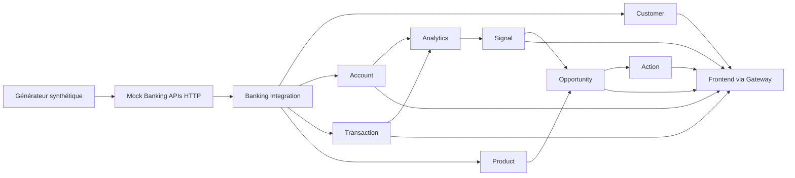

# Flux de données — BOA SME Opportunity Intelligence

**Statut :** cible d’architecture du MVP ; l’état réel est suivi dans [`docs/final-status.md`](../docs/final-status.md).

## 1. Flux nominal

Le flux part de faits bancaires synthétiques et aboutit à une recommandation commerciale explicable. Le seed ne crée aucune opportunité ; celles-ci sont calculées après import, à partir des faits persistés.

## 2. Étapes

1. Le générateur prépare clients, comptes, soldes, transactions, détentions de produits et règles versionnées.
2. Banking Integration appelle les APIs simulées par HTTP, normalise les réponses et transmet des lots idempotents aux services propriétaires.
3. Customer, Account, Transaction et Product valident et persistent chacun leurs données dans leur schéma.
4. Analytics calcule les fenêtres `7D`, `30D`, `90D`, `180D` et `365D`, les comparaisons et la qualité.
5. Signal Service applique les règles versionnées et conserve les preuves.
6. Opportunity Service combine métriques, signaux, profil et catalogue. Il calcule `confidence` sur `0..1`, `priorityScore` sur `0..100`, l’horizon et l’explication.
7. Action Service conserve les actions et outcomes. Il possède `engagementStatus`; Opportunity Service possède `opportunityStatus` (`OPEN`, `EXPIRED`, `SUPERSEDED`).

## 3. Communication et reprise

Les lectures et commandes courtes utilisent HTTP interne, authentification de service, timeouts, retries bornés et `X-Correlation-ID`. Chaque émetteur écrit ses événements dans une outbox locale avec `eventId`, `eventType`, `eventVersion`, `occurredAt`, `aggregateId`, `correlationId`, `causationId`, `idempotencyKey` et `payload`. Les consommateurs sont idempotents. Aucun broker n’est une dépendance du MVP ; son ajout est futur.

## 4. Références

[1]: ../docs/implementation-blueprint.md "Blueprint d’implémentation exécutable"
[2]: ../docs/data-model.md "Modèle relationnel PostgreSQL"
[3]: ../docs/business-rules.md "Moteur déterministe d’intelligence d’opportunités"

## Références

[1]: ../docs/implementation-blueprint.md "Blueprint d’implémentation exécutable"
[2]: ../docs/data-model.md "Modèle relationnel PostgreSQL"
[3]: ../docs/business-rules.md "Moteur déterministe d’intelligence d’opportunités"
