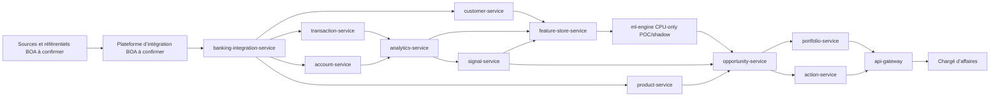

# Architecture cible d’intégration au SI bancaire

**Produit :** BOA SME Opportunity Intelligence
**Statut du document :** cible d’intégration et conditions de pilote ; ce document ne vaut ni homologation BOA ni contrat d’interface signé.
**Périmètre :** raccordement progressif aux référentiels et services bancaires, en conservant les frontières et contrats du dépôt.
**Date de rédaction :** 19 septembre 2026.

## 1. Position de synthèse

L’architecture proposée conserve `api-gateway` comme seul point d’entrée de l’application et `banking-integration-service` comme couche d’anti-corruption entre les systèmes bancaires et les services métier. Les systèmes BOA réels ne sont pas nommés ici lorsqu’ils ne sont pas identifiés dans le dépôt. Le raccordement doit donc se faire par des interfaces à confirmer avec BOA, sans introduire de dépendance directe du moteur d’opportunités au Core Banking, au CRM ou à une base partagée.

Le dépôt démontre un flux HTTP de données synthétiques vers `banking-integration-service`, puis vers les services propriétaires `customer-service`, `account-service`, `transaction-service` et `product-service`. Il démontre aussi une synchronisation d’affectation portefeuille datée, idempotente, auditée et propagée par outbox. Ces preuves sont fonctionnelles et locales ; elles ne constituent pas un raccordement au SI bancaire ni une mesure de production. Voir [`architecture/data-flow.md`](../../architecture/data-flow.md), [`architecture/architecture.md`](../../architecture/architecture.md) et [`docs/finalization-status-2026-09-19.md`](../finalization-status-2026-09-19.md).

Le produit est une aide commerciale explicable. **Aucune décision de crédit, d’octroi, de refus, de limite ou de tarification n’est prise.** `FINANCIAL_STRESS_SIGNAL` reste un signal relationnel destiné à l’examen humain. Le ML classique est **CPU-only** et verrouillé en `POC_SHADOW`; la priorité reste `RULES_ONLY` tant que les labels historiques BOA matures et la validation indépendante ne sont pas disponibles. **Aucun LLM et aucun GPU ne sont requis.**

Les éléments non démontrés dans le dépôt, notamment les systèmes sources réels, les cadences, les volumes cibles, les coûts, les seuils de service, les durées de conservation et les exigences de production, portent explicitement la mention **HYPOTHÈSE À VALIDER AVEC BOA**.

## 2. Lecture de l’existant

### 2.1 Capacités effectivement présentes

| Domaine | Statut | Ce que le dépôt permet d’affirmer | Preuve interne |
|---|---|---|---|
| Entrée applicative | **IMPLÉMENTÉ / PROUVÉ** | `api-gateway` route les appels publics `/api/v1`, valide le contexte d’accès et propage `X-Correlation-ID`. Le navigateur ne contacte pas les services internes. | [`backend/src/boa_oi/gateway_api.py`](../../backend/src/boa_oi/gateway_api.py), [`docs/api.md`](../api.md) |
| Couche d’intégration bancaire | **IMPLÉMENTÉ / PROUVÉ** | `banking-integration-service` appelle `HttpBankingAdapter`, normalise les réponses et transmet des lots aux services propriétaires. | [`backend/src/boa_oi/banking_integration_api.py`](../../backend/src/boa_oi/banking_integration_api.py), [`backend/src/boa_oi/http_clients.py`](../../backend/src/boa_oi/http_clients.py) |
| Sources réellement disponibles | **IMPLÉMENTÉ / PROUVÉ** | Les endpoints `/mock/v1/customers`, `/mock/v1/accounts`, `/mock/v1/balances`, `/mock/v1/transactions` et `/mock/v1/products` sont des APIs synthétiques HTTP. | [`backend/src/boa_oi/mock_banking_api.py`](../../backend/src/boa_oi/mock_banking_api.py) |
| Import consolidé | **IMPLÉMENTÉ / PROUVÉ** | `POST /internal/v1/imports/all` récupère clients, comptes, soldes, transactions et produits, puis appelle les endpoints d’import des services propriétaires. | [`backend/src/boa_oi/banking_integration_api.py`](../../backend/src/boa_oi/banking_integration_api.py) |
| Import par transactions | **IMPLÉMENTÉ / PROUVÉ** | `POST /internal/v1/imports/transactions` existe côté intégration et transmet un lot idempotent à `transaction-service`. | [`backend/src/boa_oi/banking_integration_api.py`](../../backend/src/boa_oi/banking_integration_api.py) |
| Référentiel client et affectations | **IMPLÉMENTÉ / PROUVÉ** | `customer-service` possède le profil PME, les responsables, les affectations temporelles et la synchronisation `POST /internal/v1/portfolio-assignments/sync`. | [`backend/src/boa_oi/customer_api.py`](../../backend/src/boa_oi/customer_api.py), [`docs/lots/LOT-03-SYNCHRONISATION-PORTEFEUILLE.md`](../lots/LOT-03-SYNCHRONISATION-PORTEFEUILLE.md) |
| Idempotence portefeuille | **IMPLÉMENTÉ / PROUVÉ** | La clé `Idempotency-Key`, le `batchRef`, le `sourceEventId` et le hash de contenu évitent les doubles traitements et détectent les réutilisations contradictoires. | [`backend/src/boa_oi/customer_api.py`](../../backend/src/boa_oi/customer_api.py) |
| Historisation portefeuille | **IMPLÉMENTÉ / PROUVÉ** | Les affectations sont bornées par `validFrom` et `validTo`; les événements hors ordre et les corrections historiques sont rejetés plutôt qu’appliqués silencieusement. | [`backend/src/boa_oi/customer_api.py`](../../backend/src/boa_oi/customer_api.py), [`docs/lots/LOT-03-SYNCHRONISATION-PORTEFEUILLE.md`](../lots/LOT-03-SYNCHRONISATION-PORTEFEUILLE.md) |
| Événements | **IMPLÉMENTÉ / PROUVÉ** | Les services écrivent des événements dans une outbox locale avec corrélation et causation. Aucun broker permanent n’est requis par le MVP. | [`architecture/data-flow.md`](../../architecture/data-flow.md), [`docs/deployment.md`](../deployment.md) |
| ML | **IMPLÉMENTÉ / PROUVÉ dans le POC shadow** | La chaîne Feature Store → ML Engine persiste un score versionné et traçable ; Opportunity conserve l’observation séparée mais sa priorité reste issue des règles. | [`docs/ml-engine.md`](../ml-engine.md), [`LOT-10-ML-SHADOW-DEFENDABLE.md`](../lots/LOT-10-ML-SHADOW-DEFENDABLE.md) |
| Raccordement aux SI BOA réels | **NON IMPLÉMENTÉ** | Aucun raccordement réel au Core Banking, au CRM, aux paiements, au Trade Finance ou à un entrepôt BOA n’est démontré. | [`docs/finalization-status-2026-09-19.md`](../finalization-status-2026-09-19.md) |
| Annuaire, plateforme d’intégration et SIEM BOA | **NON IMPLÉMENTÉ** | Les composants locaux ne prouvent pas la connexion à l’annuaire, à la plateforme d’intégration, au SIEM ou au coffre de secrets BOA. | [`docs/security.md`](../security.md), [`docs/finalization-status-2026-09-19.md`](../finalization-status-2026-09-19.md) |

### 2.2 Ce qui est une preuve et ce qui ne l’est pas

Les données du MVP sont exclusivement synthétiques. Les résultats de validation locaux, y compris les volumes de démonstration et les temps d’exécution éventuellement consignés dans les rapports, ne sont ni des données BOA, ni des SLO, ni des KPI commerciaux, ni des performances prédictives de production. Aucun gain commercial, taux de conversion, coût d’exploitation, volumétrie cible, seuil de qualité ou délai de synchronisation BOA n’est mesuré dans ce dépôt. Toute valeur de cette nature est **HYPOTHÈSE À VALIDER AVEC BOA**.

## 3. Architecture cible sans dépendance à des systèmes inconnus

### 3.1 Principe de séparation

L’intégration cible suit quatre zones :

1. **Systèmes sources et référentiels BOA**, dont les noms, protocoles et responsabilités restent à confirmer.
2. **Plateforme d’intégration BOA**, si elle est imposée par l’architecture d’entreprise. Elle transporte ou orchestre les échanges sans devenir une source de vérité métier pour les clients, comptes ou transactions.
3. **`banking-integration-service`**, qui porte les adaptateurs, le mapping canonique, les contrôles de lot, les reprises et les journaux d’import.
4. **Services métier BOA SME Opportunity Intelligence**, qui restent propriétaires de leurs données et ne lisent pas une base transverse.

Le moteur ne doit jamais appeler directement le Core Banking, le CRM, le référentiel produits ou un système de paiement. Il consomme les contrats internes de `customer-service`, `account-service`, `transaction-service`, `product-service`, `analytics-service`, `signal-service`, `opportunity-service`, `portfolio-service` et `action-service`.

### 3.2 Vue logique



Les noms `SRC` et `INT` sont des rôles logiques, non des systèmes BOA identifiés. L’implémentation de chaque raccordement dépendra du contrat d’interface retenu par BOA. **HYPOTHÈSE À VALIDER AVEC BOA :** la plateforme d’intégration impose un transport commun, une authentification commune ou un format commun. Le dépôt ne permet pas de choisir entre API, fichiers, messages ou autre mode de transport pour les systèmes réels.

## 4. Interfaces à confirmer avec BOA

Le tableau suivant décrit un contrat proposé, à utiliser comme base de cadrage et non comme contrat accepté. Les noms d’objets et de routes déjà présents dans le dépôt restent inchangés ; les noms de systèmes BOA absents ne sont pas inventés.

| Interface à confirmer | Sens proposé | Données minimales attendues | Contrat proposé et contrôles | Statut |
|---|---|---|---|---|
| **Core Banking** | Core Banking → `banking-integration-service` | Identifiants stables de PME et de compte, statut, devise, soldes observés, dates d’observation, identifiants de source | API ou échange batch à préciser. Le mapping cible alimente `Customer`, `Account` et `BalanceSnapshot`. Chaque objet porte `sourceSystem`, identifiant externe, date d’observation, `correlationId` et version de schéma. | **À VALIDER** ; adaptateur réel **NON IMPLÉMENTÉ** |
| **Référentiel clients** | Référentiel clients → `customer-service` via intégration | Identifiant client, raison sociale, segment, secteur, statut et attributs nécessaires au périmètre commercial | `POST /internal/v1/imports/customers` existe pour le lot interne. La source BOA doit préciser la clé maîtresse, les corrections, les suppressions, les changements d’identifiant et la qualité attendue. | Contrat interne **IMPLÉMENTÉ** ; source réelle **À VALIDER** |
| **Référentiel produits** | Référentiel produits → `product-service` via intégration | `productId`, libellé, catégorie, segment cible, devise, statut, règles d’éligibilité et détentions si disponibles | `POST /internal/v1/imports/products` est appelé par `banking-integration-service`. Les règles de catalogue restent des données de référence ; aucune règle BOA n’est inventée ici. | Contrat interne **IMPLÉMENTÉ** ; données BOA **À VALIDER** |
| **CRM commercial** | CRM ↔ `customer-service`, `portfolio-service` et `action-service` selon ownership | Chargé d’affaires, agence, portefeuille, affectation primaire, actions et outcomes autorisés | Le sens maître de chaque donnée doit être fixé. La synchronisation portefeuille existante accepte `contractVersion: "1.0"`, `sourceSystem`, `batchRef`, `sourceWatermark`, `sourceEventId`, `customerId`, `portfolioId`, `relationshipManagerId`, `branchId`, `validFrom`, `validTo` et `reason`. | Contrat de synchronisation **IMPLÉMENTÉ** ; raccord CRM **NON IMPLÉMENTÉ / À VALIDER** |
| **Entrepôt de données** | Services de données BOA → export gouverné vers analyse/ML, ou projection contrôlée | Historique approuvé, dates d’observation, labels/outcomes, définition de population, version du dataset | Aucun accès SQL direct depuis un système inconnu. Un export gouverné et pseudonymisé doit porter la finalité, la période, la version, la qualité et la traçabilité point-in-time. | **NON IMPLÉMENTÉ** ; gouvernance **À VALIDER** |
| **Annuaire entreprise** | Annuaire → IdP / plateforme d’exécution | Identité, groupes ou rôles, statut, périmètre organisationnel, éventuellement agence et portefeuille | Le dépôt utilise OIDC/OAuth2 et des rôles applicatifs. BOA doit confirmer le fournisseur, le mapping des rôles `RELATIONSHIP_MANAGER`, `BRANCH_MANAGER`, `DATA_ANALYST` et `ADMIN`, le MFA, la révocation et la propagation du périmètre. | Intégration réelle **NON IMPLÉMENTÉE** ; contrat IAM **À VALIDER** |
| **Plateforme d’intégration** | Orchestration ou transport entre sources BOA et `banking-integration-service` | Identifiant de message/lot, version, corrélation, reprise, accusé de réception, état de rejet | Le dépôt prévoit HTTP interne, retries bornés, timeout, circuit breaker côté client et outbox locale. BOA doit décider si la plateforme fournit un transport au moins une fois, une file de quarantaine, un ordonnanceur et une rétention. | **NON IMPLÉMENTÉE** côté BOA ; choix **À VALIDER** |
| **Messagerie SMTP** | Notification Service → relais SMTP BOA | Destinataire vérifié, expéditeur autorisé, sujet et contenu commercial minimisé | Les paramètres `SMTP_HOST`, `SMTP_PORT`, `SMTP_USERNAME`, `SMTP_PASSWORD`, `SMTP_STARTTLS`, `SMTP_SSL` et `SMTP_FROM` existent. TLS est obligatoire dans le lot local. Hôtes, certificats, domaines, comptes, limites et conservation BOA restent à fournir. | Connecteur local **IMPLÉMENTÉ / PROUVÉ** ; relais BOA **NON IMPLÉMENTÉ / À VALIDER** |
| **SIEM** | Services et plateforme d’intégration → SIEM | Événement d’audit, acteur/service, action, ressource, résultat, horodatage, version, `correlationId`, sévérité | Export structuré sans secret, token, nom de PME ou détail transactionnel inutile. Le dépôt persiste un audit local append-only, mais ne démontre ni connecteur SIEM, ni rétention, ni chaîne WORM BOA. | **NON IMPLÉMENTÉ** ; rétention et format **À VALIDER** |
| **Secrets** | Coffre BOA → services et plateforme | Secrets de service, certificats, mots de passe de base, clés de signature, credentials SMTP | Aucun secret ne doit être versionné ou journalisé. Remplacer les valeurs de développement par des références injectées au démarrage, avec rotation, révocation, séparation des rôles et audit d’accès. Le choix du coffre et le cycle de rotation sont **HYPOTHÈSE À VALIDER AVEC BOA**. | Variables d’environnement locales **IMPLÉMENTÉES** ; coffre BOA **NON IMPLÉMENTÉ** |

### 4.1 Interface Core Banking : limites de ce qui est connu

Le dépôt expose une abstraction `HttpBankingAdapter` et des méthodes `fetch_customers`, `fetch_accounts`, `fetch_balances`, `fetch_transactions` et `fetch_products`. Les chemins effectivement codés sont ceux de l’API synthétique `/mock/v1/...`; ils ne sont pas les chemins du SI BOA. Il serait incorrect de les présenter comme une API du Core Banking.

Le raccordement réel doit donc fournir un nouvel adaptateur conforme aux ports documentés, sans modifier le domaine métier pour traiter un cas « mock ». Les champs de mapping, la sémantique de la date de valeur, la gestion des comptes clôturés, les annulations, les corrections, les devises, les fuseaux horaires et le périmètre de clients sont **HYPOTHÈSE À VALIDER AVEC BOA**.

### 4.2 Référentiel clients, produits et CRM

`customer-service` est propriétaire de la projection utilisée par l’application. Il ne doit pas devenir une copie concurrente du référentiel BOA. Le contrat d’intégration doit préciser la source de vérité de chaque attribut, le droit de correction, l’état de suppression et le traitement des désaccords.

La synchronisation portefeuille existante est plus précise qu’un simple remplacement de champ : elle conserve des intervalles temporels et refuse un événement antérieur au dernier intervalle connu avec `409 OUT_OF_ORDER_ASSIGNMENT`. Elle refuse également un contenu différent réutilisant un même `sourceEventId` avec `409 SOURCE_EVENT_REUSED`, une affectation terminée nécessitant une réconciliation historique avec `409 HISTORICAL_RECONCILIATION_REQUIRED`, et un responsable déjà rattaché à une autre agence avec `409 RELATIONSHIP_MANAGER_BRANCH_CONFLICT`.

Cette politique convient comme garde-fou de pilote. La gestion des affectations secondaires, des délégations, des suppressions/résiliations source et de la réconciliation rétroactive multi-intervalles est **NON IMPLÉMENTÉE** selon [`docs/lots/LOT-03-SYNCHRONISATION-PORTEFEUILLE.md`](../lots/LOT-03-SYNCHRONISATION-PORTEFEUILLE.md). Sa règle cible est **HYPOTHÈSE À VALIDER AVEC BOA**.

## 5. Flux cibles, cadence et responsabilités

### 5.1 Flux d’initialisation

Le flux d’initialisation proposé est le suivant :

1. BOA fournit un lot ou une API conforme au contrat approuvé, avec `sourceSystem`, un identifiant de lot, une version de schéma et un point de reprise.
2. La plateforme d’intégration transmet le lot à `banking-integration-service` ou celui-ci appelle l’interface source selon le mode retenu.
3. `banking-integration-service` valide l’enveloppe, calcule un hash de requête, contrôle les identifiants externes et conserve l’état d’import.
4. Le service transmet les données à `customer-service`, `account-service`, `transaction-service` et `product-service` avec une clé `Idempotency-Key` dérivée de façon déterministe du lot et du sous-lot.
5. Les services propriétaires valident et persistent leurs données dans leurs schémas respectifs.
6. Les événements d’outbox déclenchent ou permettent les recalculs `Analytics → Signals → Opportunities`, sans bloquer l’accusé de réception du lot par un calcul long.

Ce séquencement reprend le flux documenté dans [`architecture/data-flow.md`](../../architecture/data-flow.md). **HYPOTHÈSE À VALIDER AVEC BOA :** l’initialisation peut être réalisée par un export complet, un flux incrémental ou une combinaison des deux.

### 5.2 Flux incrémental et portefeuille

Pour un changement de portefeuille, le contrat proposé est `POST /internal/v1/portfolio-assignments/sync` avec `Idempotency-Key` et un corps `PortfolioSyncBatch`. Le lot est trié par `(validFrom, sourceEventId)`. La réponse inclut `jobId`, `status`, `sourceSystem`, `batchRef`, `sourceWatermark`, `received`, `applied`, `unchanged`, `replayedEvents` et le résultat de chaque événement.

Un rejeu identique du même lot retourne la réponse précédente avec `replayed=true`. Un contenu différent sous la même clé ou le même couple `sourceSystem`/`batchRef` est rejeté. Une modification appliquée produit `PORTFOLIO_ASSIGNMENT_CHANGED` dans l’outbox locale. Customer, Portfolio et Opportunity doivent lire l’affectation active selon `validFrom <= now < validTo`; le détail de cette propagation est documenté dans le lot de synchronisation portefeuille.

### 5.3 Cadences proposées

Le dépôt ne contient aucune cadence BOA approuvée. Le tableau ci-dessous présente uniquement une proposition de travail ; chaque ligne est **HYPOTHÈSE À VALIDER AVEC BOA**.

| Flux | Cadence proposée pour le pilote | Déclenchement | Point de reprise proposé | Responsable opérationnel proposé |
|---|---|---|---|---|
| Référentiel clients | **HYPOTHÈSE À VALIDER AVEC BOA :** incrémental selon la capacité source | Événement ou lot planifié | `sourceWatermark` ou identifiant de lot | BOA propriétaire du référentiel, avec contrôle par `banking-integration-service` |
| Comptes et soldes | **HYPOTHÈSE À VALIDER AVEC BOA :** lot périodique | Lot source ou commande administrative | Date d’observation + identifiant externe | BOA propriétaire des comptes et soldes |
| Transactions | **HYPOTHÈSE À VALIDER AVEC BOA :** fenêtres bornées et rejouables | Lot périodique ou événement source | Couple période / watermark source | BOA propriétaire des mouvements, avec réconciliation par intégration |
| Produits et détentions | **HYPOTHÈSE À VALIDER AVEC BOA :** synchronisation à chaque changement ou lot | Publication du référentiel produit | Version du catalogue | BOA propriétaire du catalogue |
| Affectations portefeuille | **HYPOTHÈSE À VALIDER AVEC BOA :** événement dès changement, avec lot de rattrapage | Événement d’affectation ou lot de correction | `sourceEventId` + `sourceWatermark` | BOA propriétaire de l’affectation commerciale |
| Recalcul analytique | **HYPOTHÈSE À VALIDER AVEC BOA :** après import confirmé | Événement `TransactionImported` ou commande | `batchId` + version de données | Équipe produit pour l’orchestration ; BOA valide la fenêtre d’observation |
| Notifications SMTP | **HYPOTHÈSE À VALIDER AVEC BOA :** cadence approuvée par les métiers | Outbox d’action ou synthèse planifiée | `Message-ID` et état de livraison | Notification Service pour le dispatch ; BOA pour relais et destinataires |

Aucun horaire, délai maximal, volume quotidien ou fréquence figurant dans ce tableau ne doit être interprété comme un engagement.

## 6. Contrat d’échange proposé

### 6.1 Enveloppe commune

L’enveloppe minimale proposée pour tout lot ou événement est la suivante. Les valeurs d’exemple sont des identifiants techniques, non des données BOA.

```json
{
  "contractVersion": "1.0",
  "sourceSystem": "source-a-confirmer",
  "batchRef": "batch-opaque",
  "sourceWatermark": "watermark-opaque",
  "correlationId": "corr-opaque",
  "occurredAt": "2026-09-19T00:00:00Z",
  "schemaVersion": "1.0",
  "items": []
}
```

Les dates sont en RFC 3339 UTC. Les identifiants externes sont conservés pour le dédoublonnage et la réconciliation. Les propriétés inconnues peuvent être ignorées par les consommateurs si le contrat le permet, mais les champs obligatoires et la compatibilité de version doivent être contrôlés.

### 6.2 Contrat portefeuille

Le contrat déjà implémenté accepte un `PortfolioSyncBatch` contenant :

| Champ | Rôle |
|---|---|
| `contractVersion` | Version contractuelle, actuellement `"1.0"` |
| `sourceSystem` | Identifie la source logique, valeur à faire approuver par BOA |
| `batchRef` | Identifiant stable et rejouable du lot |
| `sourceWatermark` | Point de progression de la source, facultatif dans le code actuel |
| `assignments` | Liste d’affectations, bornée par le modèle actuel |
| `sourceEventId` | Identifiant stable de chaque changement |
| `customerId`, `portfolioId`, `relationshipManagerId`, `branchId` | Références métier externes |
| `validFrom`, `validTo` | Intervalle d’effet en UTC |
| `assignmentType`, `isPrimary` | Type d’affectation ; le code actuel impose `PRIMARY` et primaire |
| `reason` | Motif obligatoire de l’événement |

La sémantique de `portfolioId`, les règles d’affectation secondaire et les droits de correction sont **HYPOTHÈSE À VALIDER AVEC BOA**. Le code actuel ne doit pas être élargi silencieusement pour couvrir ces cas.

### 6.3 Erreurs, rejets et quarantaine

Les erreurs doivent conserver `X-Correlation-ID`, un code stable et un message ne révélant pas de données inutiles. Le contrat général documente notamment `400`, `401`, `403`, `404`, `409`, `422`, `429`, `502`, `503` et `504`. Pour l’intégration, les rejets doivent être classés au minimum ainsi :

| Classe | Exemples | Action proposée |
|---|---|---|
| Rejet déterministe | Schéma invalide, champ obligatoire absent, devise non autorisée selon le référentiel approuvé | Ne pas rejouer automatiquement ; conserver la ligne et le motif ; corriger à la source ou via une procédure approuvée. |
| Conflit d’idempotence | `IDEMPOTENCY_KEY_REUSED`, `SOURCE_EVENT_REUSED` | Bloquer le lot ou l’événement contradictoire ; demander une décision opérationnelle. |
| Hors ordre | `OUT_OF_ORDER_ASSIGNMENT` | Ne pas réécrire l’historique ; ouvrir une réconciliation administrée. |
| Référence inconnue | `CUSTOMER_NOT_FOUND` ou compte non connu du service propriétaire | Mettre en attente ou rejeter selon la politique BOA ; ne jamais créer une référence critique par défaut. |
| Indisponibilité technique | Timeout, `502`, `503`, `504` | Retry borné avec backoff ; ensuite quarantaine et alerte. Les bornes sont **HYPOTHÈSE À VALIDER AVEC BOA**. |
| Réponse source ambiguë | Accusé absent après timeout, doublon non résolu | Ne pas supposer l’échec ou le succès ; réconcilier par identifiant de lot/message. |

Le dépôt démontre des erreurs applicatives et des outbox locales, mais pas une file morte, une quarantaine intégrée à la plateforme BOA ou une procédure d’exploitation complète. Ces éléments sont **NON IMPLÉMENTÉS** et **HYPOTHÈSE À VALIDER AVEC BOA**.

## 7. Idempotence et réconciliation

### 7.1 Règles d’idempotence

Chaque commande d’import doit porter `Idempotency-Key`. Une répétition avec une clé et un corps identiques retourne le résultat initial. Une répétition avec un contenu différent retourne `409 IDEMPOTENCY_KEY_REUSED`. Cette règle existe déjà pour les imports et la synchronisation portefeuille dans les services du dépôt.

Les messages et événements doivent également être dédupliqués par `eventId` ou identifiant équivalent. Les consommateurs appliquent l’opération une seule fois dans leur état métier, même si la livraison est au moins une fois. Les identifiants externes et le `sourceSystem` sont nécessaires pour éviter les collisions entre sources.

### 7.2 Réconciliation quotidienne ou de fin de lot

Le mécanisme de réconciliation doit comparer, pour chaque lot accepté :

- le nombre reçu par type d’objet ;
- le nombre appliqué, inchangé, rejeté, mis en attente et rejoué ;
- la plage temporelle couverte ;
- le dernier `sourceWatermark` confirmé ;
- les identifiants externes manquants, dupliqués ou contradictoires ;
- les totaux de contrôle fournis par la source, si BOA les définit ;
- l’état des projections et des événements d’outbox associés.

La présence de totaux, de seuils d’écart, d’un délai de résolution et d’une cadence de rapprochement est **HYPOTHÈSE À VALIDER AVEC BOA**. Le dépôt ne contient pas de mesure de réconciliation sur données BOA et ne permet pas d’inventer ces seuils.

La réconciliation portefeuille doit en particulier traiter les événements hors ordre, les affectations terminées, les suppressions source et les changements d’agence. Les trois premiers contrôles sont partiellement encadrés par les rejets existants ; les corrections historiques multi-intervalles, les suppressions/résiliations et les délégations restent **NON IMPLÉMENTÉES**.

## 8. Sécurité, confidentialité et exploitation

### 8.1 Identité et autorisation

Le modèle de sécurité cible repose sur OIDC/OAuth2. Le Gateway et chaque service valident signature, émetteur, audience et expiration du jeton. Les appels internes utilisent des jetons de service `client_credentials`; un header libre envoyé par le navigateur ne suffit jamais. Les autorisations combinent rôle, scopes, périmètre organisationnel, affectation temporelle et ownership. Voir [`docs/security.md`](../security.md) et [`docs/api.md`](../api.md).

L’annuaire entreprise BOA doit être raccordé au fournisseur d’identité retenu sans exposer les identifiants de périmètre dans une URL ou un message non protégé. Le mapping entre groupes d’annuaire et rôles applicatifs, la MFA, la révocation, les comptes techniques et la séparation des responsabilités sont **HYPOTHÈSE À VALIDER AVEC BOA**.

### 8.2 Réseau et chiffrement

Les appels internes ne doivent pas être exposés à Internet. En environnement déployé, les tokens de service doivent être associés à une audience propre et à mTLS ou à un contrôle réseau équivalent. Le TLS, la gestion des certificats, les zones réseau, les règles de sortie vers les sources et le choix d’un WAF ou d’une passerelle sont **HYPOTHÈSE À VALIDER AVEC BOA**.

### 8.3 Données et minimisation

Le moteur n’a besoin que des attributs nécessaires à l’explication et à la priorisation commerciale autorisée. Les données transactionnelles détaillées ne doivent pas être recopiées dans les notifications ou les logs. Les secrets, tokens et mots de passe ne doivent être ni versionnés ni journalisés. Les durées de conservation, la base légale, la pseudonymisation, les droits des personnes, la résidence et les transferts sont **HYPOTHÈSE À VALIDER AVEC BOA** par les fonctions compétentes.

### 8.4 Audit et SIEM

Les services produisent des audits locaux avec acteur ou service, action, ressource, résultat, horodatage, versions et `correlationId`. L’export vers le SIEM, le format, la criticité, la rétention, la chaîne de conservation et le traitement des événements non livrés sont **NON IMPLÉMENTÉS** et **HYPOTHÈSE À VALIDER AVEC BOA**. Une intégration SIEM ne doit pas envoyer de secret, de token ou de donnée client inutile.

### 8.5 Secrets

Les variables d’environnement et secrets de développement présents dans le dépôt ne sont pas une solution de production. Le pilote avec données réelles doit utiliser le coffre de secrets BOA ou un mécanisme homologué, avec identité de service distincte, rotation et révocation. Le nom du coffre, la fréquence de rotation, les propriétaires et le mode de secours sont **HYPOTHÈSE À VALIDER AVEC BOA**.

## 9. Responsabilités et dépendances

| Responsabilité | Propriétaire proposé | Dépendance ou décision requise | Statut |
|---|---|---|---|
| Définir la source de vérité client | BOA propriétaire du référentiel clients | Identifiant maître, corrections, suppression, qualité | **À VALIDER** |
| Définir la source de vérité portefeuille | BOA propriétaire de l’affectation commerciale | Sémantique de `portfolioId`, historique, délégation, résiliation | **À VALIDER** |
| Fournir les contrats d’accès sources | BOA équipes Core Banking, référentiels, CRM et produits | Format, transport, authN/authZ, limites, versioning | **À VALIDER** |
| Implémenter les adaptateurs réels | Équipe d’intégration du produit avec l’équipe BOA concernée | Accès non productif, jeux de test, certificats, environnement | **NON IMPLÉMENTÉ** |
| Contrôler les lots et rejets | `banking-integration-service` | Politique de quarantaine et outil d’exploitation | Socle **IMPLÉMENTÉ**, exploitation BOA **À VALIDER** |
| Posséder les données métier | Services respectifs (`customer-service`, `account-service`, `transaction-service`, `product-service`) | Contrats API et absence de SQL transverse | **IMPLÉMENTÉ** dans le POC |
| Décider de l’usage commercial | BOA métier et conformité | Périmètre d’usage, libellés, interdiction de décision de crédit | **À VALIDER** |
| Exploiter l’IAM et les secrets | BOA IAM / sécurité / plateforme | Annuaire, coffre, certificats, rotation, comptes de service | **NON IMPLÉMENTÉ** |
| Exploiter le SIEM et l’observabilité | BOA sécurité / exploitation | Collecteur, rétention, alertes, runbooks | **NON IMPLÉMENTÉ** |
| Valider les labels et l’usage ML | BOA data, risque et conformité | Labels matures, finalité, biais, validation indépendante | **NON IMPLÉMENTÉ / À VALIDER** |

Aucun composant ML ne doit être transformé en décision de crédit. L’acceptation ou le rejet d’une action commerciale reste sous la responsabilité humaine et les règles BOA applicables.

## 10. Conditions de pilote

Le pilote ne peut démarrer avec des données BOA qu’après les conditions suivantes. Toute durée, population, volumétrie, cadence, KPI ou seuil de réussite doit être approuvée par BOA ; à défaut, elle reste **HYPOTHÈSE À VALIDER AVEC BOA**.

### 10.1 Préconditions bloquantes

| Précondition | Critère de sortie | Statut |
|---|---|---|
| Contrats sources approuvés | Les interfaces Core Banking, référentiel clients, référentiel produits, CRM et portefeuille ont un propriétaire, une version, une méthode d’authentification et un jeu de test | **À VALIDER** |
| Périmètre de données autorisé | Finalité, minimisation, classification, base de traitement, conservation et droits d’accès validés | **À VALIDER** |
| Identité et comptes techniques | Annuaire, rôles, scopes, MFA, comptes de service et révocation testés | **NON IMPLÉMENTÉ / À VALIDER** |
| Secrets et certificats | Coffre, certificats, rotation et absence de secrets en logs vérifiés | **NON IMPLÉMENTÉ / À VALIDER** |
| Rejets et réconciliation | Runbook, propriétaires, quarantaine, reprise et rapprochement acceptés | **NON IMPLÉMENTÉ / À VALIDER** |
| Observabilité et audit | Logs corrélés, métriques, traces, export SIEM et conservation approuvés | **NON IMPLÉMENTÉ / À VALIDER** |
| Raccordements réels | Adaptateurs testés sur environnement non productif BOA et validation des mappings | **NON IMPLÉMENTÉ** |
| ML | `POC_SHADOW` et `RULES_ONLY` confirmés ; blockers d’activation persistés ; absence de décision de crédit ; aucun entraînement BOA revendiqué | Socle POC **PROUVÉ** ; toute influence ML **BLOQUÉE / À VALIDER** |
| Continuité | Sauvegarde, restauration, haute disponibilité et objectifs de reprise définis | **NON IMPLÉMENTÉ / À VALIDER** |

### 10.2 Déroulement contrôlé proposé

Le déroulement recommandé est :

1. utiliser un environnement BOA non productif et un jeu de données approuvé ;
2. exécuter une initialisation contrôlée avec rapprochement avant et après lot ;
3. tester les rejets déterministes, les timeouts, les replays, les doublons et les événements hors ordre ;
4. vérifier le périmètre d’un `RELATIONSHIP_MANAGER`, d’un `BRANCH_MANAGER`, d’un `DATA_ANALYST` et d’un `ADMIN` ;
5. laisser le ML strictement en `POC_SHADOW`, avec une priorité exclusivement `RULES_ONLY` ;
6. recueillir les outcomes commerciaux selon une définition BOA approuvée, sans les présenter comme labels matures tant que la période de maturité n’est pas écoulée ;
7. arrêter ou suspendre le pilote en cas de fuite de périmètre, de données non autorisées, de désynchronisation non réconciliée, de défaut d’audit ou de présentation de `FINANCIAL_STRESS_SIGNAL` comme risque ou décision de crédit.

Le nombre d’agences, de chargés d’affaires, de clients, la durée calendaire, les seuils d’arrêt, les KPI de succès et le plan de support sont **HYPOTHÈSE À VALIDER AVEC BOA**. Aucun résultat commercial mesuré n’est disponible dans le dépôt.

## 11. Matrice de statut et décisions ouvertes

| Sujet | Statut | Décision à prendre |
|---|---|---|
| Contrat et identifiant du système source portefeuille | **À VALIDER** | BOA doit confirmer `sourceSystem`, `portfolioId`, `sourceEventId` et `sourceWatermark`. |
| Réconciliation historique multi-intervalles | **NON IMPLÉMENTÉ** | Définir un processus administré, sa responsabilité et ses preuves. |
| Affectations secondaires et délégations | **NON IMPLÉMENTÉ** | Confirmer si elles sont hors pilote ou nécessaires au raccordement réel. |
| Suppression/résiliation source | **NON IMPLÉMENTÉ** | Définir l’événement, la conservation de l’historique et la projection active. |
| Dispatcher outbox permanent et file morte | **NON IMPLÉMENTÉ** | Choisir le transport et les garanties d’exploitation BOA. |
| Core Banking, CRM et référentiels réels | **NON IMPLÉMENTÉ** | Fournir contrats, accès non productif, schémas et jeux de test. |
| SMTP BOA | **NON IMPLÉMENTÉ** côté production | Fournir relais, TLS, expéditeur, domaines et règles anti-abus. |
| SIEM et conservation | **NON IMPLÉMENTÉ** | Définir format, transport, rétention, criticité et runbook. |
| Coffre de secrets | **NON IMPLÉMENTÉ** | Définir fournisseur, identité d’accès, rotation et révocation. |
| Entrepôt de données et labels | **NON IMPLÉMENTÉ** | Valider finalité, extraction gouvernée, maturité et validation indépendante. |
| MLOps sur données BOA | **NON IMPLÉMENTÉ** | Ne pas entraîner ni promouvoir un modèle BOA sans labels, gouvernance et validation approuvés. |
| Décision de crédit | **NON IMPLÉMENTÉE PAR CONCEPTION** | Maintenir l’interdiction explicite ; aucune décision de crédit n’est produite. |
| LLM et GPU | **NON REQUIS** | Ne pas introduire de dépendance LLM/GPU pour le périmètre décrit. |
| KPI, coûts, SLO, seuils et volumes | **NON MESURÉS** | Chaque valeur doit être définie et approuvée par BOA avant d’être utilisée. |

## 12. Conclusion

Le dépôt fournit un socle d’intégration remplaçable : APIs internes versionnées, adaptateur bancaire HTTP, imports idempotents, services propriétaires séparés, synchronisation portefeuille temporelle, outbox locale et contrôles d’accès. Il ne fournit pas le raccordement aux systèmes BOA réels, l’exploitation SIEM, le coffre de secrets, la haute disponibilité, la réconciliation historique complète ni les contrats d’entreprise.

La trajectoire sûre consiste à confirmer les interfaces et responsabilités avec BOA, à brancher les adaptateurs derrière `banking-integration-service`, à éprouver les rejets et la réconciliation sur un environnement non productif, puis à conduire un pilote explicitement commercial et non décisionnel. Le ML reste classique, CPU-only et en POC/shadow faute de labels BOA matures. **Aucun LLM ni GPU n’est requis. Aucune décision de crédit n’est produite.**

## Références internes

[1]: ../../architecture/architecture.md "Architecture exécutable — BOA SME Opportunity Intelligence"

[2]: ../../architecture/data-flow.md "Flux de données — BOA SME Opportunity Intelligence"

[3]: ../api.md "Contrats API-first — BOA SME Opportunity Intelligence"

[4]: ../security.md "Sécurité — BOA SME Opportunity Intelligence"

[5]: ../deployment.md "Déploiement — BOA SME Opportunity Intelligence"

[6]: ../lots/LOT-03-SYNCHRONISATION-PORTEFEUILLE.md "Synchronisation portefeuille"

[7]: ../lots/LOT-06-NOTIFICATIONS-EMAIL.md "Notifications email et synthèse quotidienne"

[8]: ../finalization-status-2026-09-19.md "Rapport final de finalisation technique"

[9]: ../ml-integration-status.md "Rapport de validation d’intégration ML"

[10]: ../../backend/src/boa_oi/banking_integration_api.py "API du service d’intégration bancaire"

[11]: ../../backend/src/boa_oi/customer_api.py "API du service client et synchronisation portefeuille"

[12]: ../../backend/src/boa_oi/http_clients.py "Clients HTTP et adaptateur bancaire"

[13]: ../../backend/src/boa_oi/mock_banking_api.py "API bancaire synthétique"

[14]: ../../backend/src/boa_oi/gateway_api.py "API Gateway"

[15]: ../audit/ETAT-REEL-2026-09-19.md "État réel du dépôt"

[16]: ../industrialization-governance.md "Gouvernance d’industrialisation"

[17]: ../data-model.md "Modèle relationnel PostgreSQL et pipeline de données"

[18]: ../ml-engine.md "ML Engine CPU-ready"

[19]: ../workstreams/mlops-governance.md "Gouvernance MLOps"

[20]: ../workstreams/operations-readiness.md "Préparation opérationnelle"

[21]: ../workstreams/scoring-policy.md "Politique de scoring"

[22]: ../lots/LOT-06-NOTIFICATIONS-EMAIL.md "Connecteur SMTP et notifications"
